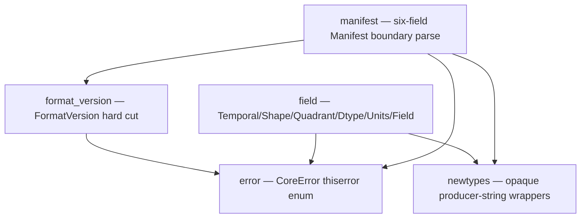

# `hdx-core`

## Purpose

`hdx-core` holds **all contract logic for HDX v0.1** (Hydrology Dataset Exchange) —
the spec and its validator are the same artifact, so the two contract-executing verbs
`validate` and `describe` (spec §10) live here. This is the crate's agent entry-point:
start here to orient before reading `src/`. As of milestone MS1, the crate establishes
the **parse-don't-validate type model** — opaque domain newtypes, the crate-wide
`CoreError`, the `FormatVersion` hard cut, the field 2×2 quadrant model with a closed
`Dtype`, and the six-field `Manifest` boundary parser. Raw input (JSON strings,
producer-chosen strings) is converted into **valid-by-construction** domain types at
the boundary; every type downstream of that boundary is conformant by construction.
The cross-file / cross-basin checks and the `validate` / `describe` verbs themselves
land in later milestones, built on these types.

## Inert and agnostic (load-bearing discipline)

> **HDX describes the *shape* of data, never *what was done to it*** (spec §1).

No type or field in this crate carries — or may ever be extended to carry — a
**transform / normalization** state, a **role** (target / forcing / future-known), a
**semantic type** (continuous / categorical), a **gridded → lumped reduction**, or any
**provenance of computation**. A prediction dataset is just an HDX dataset. Two
concrete consequences enforced by the types here:

- The [`Manifest`](src/manifest.rs) is **exactly six fields** (the §11 floor) — no
  seventh, derivable field (no content hash, no data version, no field catalog, no
  basin list). Everything else is *discovered* from the files, never *declared*.
- [`FormatVersion`](src/format_version.rs) is a **hard cut**: a single-arm enum whose
  parse accepts only `"0.1"`. No multi-version reader is representable.

Every time a design drifts toward encoding *what was done* or *what the data is for*,
it is wrong.

## Architecture — module map

Each node is a file under `crates/core/src/`. An edge `A --> B` means *module `A`
depends on module `B`*.

- **`newtypes`** — the leaf: opaque `String` wrappers (`BasinId`, `FieldName`,
  `GridLabel`, `DelineationLabel`, `Crs`, `Cadence`, `DatasetName`, `ProducerVersion`)
  with private fields, so confusion-prone values cannot be swapped at a call site. It
  depends on nothing else in the crate.
- **`error`** — the crate-wide [`CoreError`](src/error.rs); every fallible path
  returns it. Variants use named fields and are doc-commented with *when* they fire;
  several are intentional skeletons reserved for later milestones.
- **`format_version`** — the one contract-version axis, encoded as the hard cut.
- **`field`** — the field model: the two axes as enums, the four quadrants, the closed
  `Dtype` with a fallible boundary parse, opaque `Units`, and `Field` (whose
  constructor enforces `grid_label.is_some()` ⇔ `Shape::Gridded`).
- **`manifest`** — the system boundary: turns a raw `manifest.json` string into a
  valid-by-construction `Manifest` (it depends on `format_version` and `newtypes`).

The committed `schemas/manifest.schema.json` (at the repo root) mirrors the `manifest`
floor; a `jsonschema` dev-dependency test (`tests/manifest_schema.rs`) asserts the
schema and the parser agree, so neither can drift.

## Glossary

Domain terms an agent would not infer from the code alone. Spec section in parentheses.

| Term | Meaning |
|---|---|
| **field** (§2) | The unit of HDX. A scientific variable, a QC mask, a cluster id, and a model prediction are *all just fields*; HDX privileges none. A field carries only `name`, `quadrant`, `dtype`, `units`, and (iff gridded) a `grid_label`. |
| **Temporal** (§2) | The time axis of a field — an enum, never a bool: `Static` (one value) vs `Dynamic` (a time series). |
| **Shape** (§2) | The space axis of a field — an enum, never a bool: `Scalar` (a single value) vs `Gridded` (a per-cell field over the basin bbox). Deliberately *not* "lumped vs gridded": "lumped" smuggles in a reduction, whereas a scalar value (outlet streamflow) is often scalar by nature. |
| **quadrant** (§2) | The product `Temporal × Shape` — one of `ScalarStatic`, `ScalarDynamic`, `GriddedStatic`, `GriddedDynamic`. A **per-field** classification, never a dataset-level mode: one dataset's schema may freely mix all four. |
| **Dtype** (§1, §2) | The physical element encoding (`f32`, `f64`, `i32`, `i64`, `bool`, `timestamp`). A **closed** enum — HDX recognizes exactly these and *rejects* anything else (no `Other(String)`, no panic). It is **opaque to semantics**: HDX records *how a value is encoded*, never *what it means* (continuous/categorical is the consumer's job). |
| **Units** (§1, §2) | An **opaque, optional** producer string — recorded verbatim or absent, never parsed (no unit algebra, no canonicalization, no vocabulary). |
| **basin_id** (§3) | A basin's id, **unique within the dataset** — the only requirement. How it is minted (gauge id, hash, integer, UUID) is the producer's business. It is the authoritative in-file id; a later milestone (MS6) cross-checks it against the `basin=<id>` partition folder. |
| **grid label** (§8) | A stable, producer-chosen name for a *grid family*; the gridded artifact is named after it. A label **shared across the `gridded_static` and `gridded_dynamic` subtrees signals cell-for-cell alignment** — an invariant checked across basins in MS6, not here. |
| **delineation** (§9) | A **neutral** label on each outline polygon (MERIT, GRIT, HydroBASINS, a custom run, a hand-drawn polygon) — *not* assumed to name a published hydrofabric. HDX interprets nothing; disagreement between delineations is itself a modeling signal. |
| **cadence** (§6, §11) | The dataset-wide cadence / calendar convention (e.g. `"daily"`), a declared manifest convention. A non-empty opaque string here; cross-checked against the realized time axes in a later milestone. |
| **manifest floor** (§11) | The manifest is the *irreducible floor*: **exactly six fields** — `format_version`, `name`, `created_at`, `producer_version`, `crs`, `cadence` — and nothing else. Adding any derivable field is a conformance bug, so it is unrepresentable. |
| **`format_version` hard cut** (§0, §11) | `format_version` is read **first** and is a **hard cut**: only `"0.1"` is accepted (exact-string, no numeric coercion — `"0.10"` ≠ `"0.1"`); anything else is rejected outright before any other field is interpreted. |
