# `hdx-core`

## Purpose

`hdx-core` holds **all contract logic for HDX v0.1** (Hydrology Dataset Exchange) —
the spec and its validator are the same artifact, so the two contract-executing verbs
`validate` and `describe` (spec §10) live here. This is the crate's agent entry-point:
start here to orient before reading `src/`.

The crate is built on a **parse-don't-validate type model**: opaque domain newtypes,
the crate-wide `CoreError`, the `FormatVersion` hard cut, the field 2×2 quadrant model
with a closed `Dtype`, and the six-field `Manifest` boundary parser. Raw input (JSON
strings, producer-chosen strings) is converted into **valid-by-construction** domain
types at the boundary; every type downstream of that boundary is conformant by
construction.

Both verbs stand on a shared, two-halved **discovery layer** (architecture §3.5/§5)
that reads **metadata + 1-D coordinate arrays + georef only — never a gridded chunk or
pixel raster** (architecture §1) and **records facts, never a verdict**:

- The **scalar half** is the basin-first hive walk ([`layout`](src/layout.rs)), the
  scalar-parquet **metadata** reader ([`scalar_reader`](src/scalar_reader.rs)), and the
  boundary function ([`discovery`](src/discovery.rs)) that ties them into a typed
  `ScalarDiscovery`.
- The **gridded / geometry half** adds the shared grid value types
  ([`grid`](src/grid.rs)) with the single cell-edge convention, the Zarr v3 metadata
  reader ([`zarr_reader`](src/zarr_reader.rs)), the pure-Rust COG / GeoTIFF tag reader
  ([`cog_reader`](src/cog_reader.rs)), the `outlines.geoparquet` reader
  ([`geoparquet_reader`](src/geoparquet_reader.rs)), and the assembler
  ([`gridded_discovery`](src/gridded_discovery.rs)) that builds a `GriddedDiscovery` and
  **pairs** it with `ScalarDiscovery` in one `Discovery` model **without reshaping
  either half**. The assembler **observes** the spec §8 *shared grid label ⇒ alignment*
  G2 precondition (the COG and Zarr extents coincide at `10.0`/`50.0`) but renders **no
  verdict**.

On top of the discovery layer sit the two verbs:

- [`describe`](src/describe.rs) emits the **`describe` self-description** (spec §10):
  `Description` (manifest + basins + fields + grids + per-basin ragged time extents +
  delineations, architecture §3.5) plus a describe-local `#[derive(Serialize)]` DTO
  layer that owns the JSON shape **in one place**, leaving the inert domain types free
  of `serde::Serialize`. The mapping `Discovery + Manifest → Description → DTO` reports
  **facts only — no conformance verdict** (no `conformant` key).
- [`validate`](src/validate.rs) is the **`validate` conformance verb** (spec §10/§14):
  it runs the §14 `MUST` checklist over the same shared `Discovery` model and emits a
  `ValidationReport` of per-check `CheckOutcome`s — each recording **ran vs skipped**, a
  **pass/fail** result, its **R3 depth class**, and an opaque detail/reason — plus an
  overall `conformant: bool` ("**no check that ran failed**"; a skip never flips it).
  Its **entry order mirrors `describe`** (spec §0): read `manifest.json` →
  `Manifest::from_json` hard-cut `format_version` **before** discovery → `discover` →
  run the §14 rules. The **report-vs-error split is load-bearing**: a violated `MUST`
  that ran is a recorded fail outcome (⇒ `conformant: false`), **never** a returned
  `Err`; a `ValidateError` is reserved for **structural / entry** failures (an
  unreadable manifest, the §0 hard cut, an undecodable present artifact). The verb adds
  **no reader** and decodes **no gridded chunk / pixel raster** — it runs over the
  discovery layer plus the 1-D index reads the readers already do. The §14 wire shape is
  pinned by `schemas/validate.schema.json` and a committed golden report.

## Inert and agnostic (load-bearing discipline)

> **HDX describes the *shape* of data, never *what was done to it*** (spec §1).

No type or field in this crate carries — or may ever be extended to carry — a
**transform / normalization** state, a **role** (target / forcing / future-known), a
**semantic type** (continuous / categorical), a **gridded → lumped reduction**, or any
**provenance of computation**. A prediction dataset is just an HDX dataset. Two
concrete consequences enforced by the types here:

- The [`Manifest`](src/manifest.rs) is **exactly six fields** (the §11 floor) — no
  seventh, derivable field (no content hash, no data version, no field catalog, no
  basin list). Everything else is *discovered* from the files, never *declared*.
- [`FormatVersion`](src/format_version.rs) is a **hard cut**: a single-arm enum whose
  parse accepts only `"0.1"`. No multi-version reader is representable.

The discovery layer holds the same line. The scalar reader catalogs fields **purely
by physical schema** — a column named `streamflow_was_filled` is an *ordinary* field
with no suffix magic, no role, no belongs-to (spec §2). The discovery model adds **no**
manifest-floor field and **no** derivable / role / transform / semantic / provenance
field: the only provenance it records is *which read tier produced an extent*
(`Statistics` vs `BoundedColumnScan`), which is a property of the **read**, not of the
data — never a transform of the values.

Every time a design drifts toward encoding *what was done* or *what the data is for*,
it is wrong.

## Architecture — module map

Each node is a file under `crates/core/src/`. An edge `A --> B` means *module `A`
depends on module `B`*.

```mermaid
graph TD
    newtypes[newtypes — opaque producer-string wrappers]
    error[error — CoreError thiserror enum]
    format_version[format_version — FormatVersion hard cut]
    field[field — Temporal/Shape/Quadrant/Dtype/Units/Field]
    grid[grid — GridResolution/GridExtent/GridInfo + edge convention]
    manifest[manifest — six-field Manifest boundary parse]
    parquet_meta[parquet_meta — private: parquet footer/metadata only]
    layout[layout — basin-first hive walk into LayoutModel]
    scalar_reader[scalar_reader — scalar-parquet metadata reader]
    discovery[discovery — scalar half of the shared discovery layer]
    zarr_reader[zarr_reader — Zarr v3 metadata reader]
    cog_reader[cog_reader — COG/GeoTIFF tag reader]
    geoparquet_reader[geoparquet_reader — outlines schema + delineation/basin_id + CRS]
    gridded_discovery[gridded_discovery — gridded half + combined Discovery]
    describe[describe — Description type + R4 serializable DTO layer]
    validate[validate — §14 MUST checklist + ValidationReport + R4 serializable DTO layer]

    format_version --> error
    field --> error
    field --> newtypes
    grid --> newtypes
    manifest --> error
    manifest --> newtypes
    manifest --> format_version

    parquet_meta --> error
    layout --> error
    layout --> newtypes
    scalar_reader --> error
    scalar_reader --> newtypes
    scalar_reader --> field
    scalar_reader --> parquet_meta
    discovery --> error
    discovery --> newtypes
    discovery --> field
    discovery --> layout
    discovery --> scalar_reader

    zarr_reader --> error
    zarr_reader --> newtypes
    zarr_reader --> field
    zarr_reader --> grid
    cog_reader --> error
    cog_reader --> newtypes
    cog_reader --> field
    cog_reader --> grid
    geoparquet_reader --> error
    geoparquet_reader --> newtypes
    geoparquet_reader --> parquet_meta
    gridded_discovery --> error
    gridded_discovery --> newtypes
    gridded_discovery --> field
    gridded_discovery --> grid
    gridded_discovery --> layout
    gridded_discovery --> discovery
    gridded_discovery --> zarr_reader
    gridded_discovery --> cog_reader
    gridded_discovery --> geoparquet_reader

    describe --> newtypes
    describe --> field
    describe --> grid
    describe --> manifest
    describe --> scalar_reader
    describe --> gridded_discovery

    validate --> error
    validate --> newtypes
    validate --> field
    validate --> manifest
    validate --> scalar_reader
    validate --> discovery
    validate --> gridded_discovery
```

The three modules `layout` → `scalar_reader` → `discovery` form the **scalar half
of the discovery layer**; `discovery` is its single boundary function. The four
modules `grid`, then the three readers `zarr_reader` / `cog_reader` /
`geoparquet_reader`, then `gridded_discovery` form the **gridded / geometry half**;
`gridded_discovery` is its single boundary function (`discover_gridded`) and also the
home of the **combined** `Discovery` model (`discover`) that pairs both halves without
reshaping either. The `parquet_meta` node is private (the crate's one parquet
touchpoint, R1) — the helper both the scalar reader and the geoparquet reader are
layered on.

- **`newtypes`** — the leaf: opaque `String` wrappers (`BasinId`, `FieldName`,
  `GridLabel`, `DelineationLabel`, `Crs`, `Cadence`, `DatasetName`, `ProducerVersion`)
  with private fields, so confusion-prone values cannot be swapped at a call site. It
  depends on nothing else in the crate.
- **`error`** — the crate-wide [`CoreError`](src/error.rs); every fallible path
  returns it. Variants use named fields and are doc-commented with *when* they fire.
- **`format_version`** — the one contract-version axis, encoded as the hard cut.
- **`field`** — the field model: the two axes as enums, the four quadrants, the closed
  `Dtype` with a fallible boundary parse, opaque `Units`, and `Field` (whose
  constructor enforces `grid_label.is_some()` ⇔ `Shape::Gridded`).
- **`manifest`** — the system boundary: turns a raw `manifest.json` string into a
  valid-by-construction `Manifest` (it depends on `format_version` and `newtypes`).
- **`layout`** — the basin-first hive walk: turns a dataset directory into a
  typed [`LayoutModel`](src/layout.rs) — the two **root rollups**' presence facts and
  the enumerated `basin=<id>` directories (folder id parsed out, per-basin artifact
  paths recorded). **Structure-only** (no bytes read inside any artifact); hidden /
  OS-cruft entries are ignored, so working-tree cruft is never enumerated as an HDX
  path (pre-empts an L3 stray-file false positive). The single canonical doc for the
  cruft filter and the records-facts-not-verdicts stance lives in this module's `//!`.
- **`scalar_reader`** — the scalar-parquet **metadata** reader: the arrow schema
  mapped to [`Field`](src/field.rs)s, the `basin_id` column (presence + in-file
  value), the [`time` descriptor](src/scalar_reader.rs), and the **per-basin time
  extent** with its provenance. The single canonical doc for the **bounded 1-D
  fallback** (statistics-primary, bounded-column-scan fallback) and the
  **writer/reader confirmation hand-off** lives in this module's `//!`.
- **`discovery`** — the **scalar half** of the shared discovery layer: the typed
  [`ScalarDiscovery`](src/discovery.rs) model and the one boundary function
  [`discover_scalar`](src/discovery.rs) both verbs consume. The single canonical doc for
  the seam where the gridded / geometry half attaches lives in this module's `//!`.
- **`grid`** — the shared gridded-geometry value types: `GridResolution` (signed
  per-axis), `GridExtent` (the **single north-west cell-EDGE origin convention** plus
  the Zarr center→edge half-pixel rule), and `GridInfo` (per-grid-label representative
  geometry + recorded `Crs`). Pure types, **no IO and no new crates**; the load-bearing
  cell-edge convention is stated here and is what makes the G2 precondition observable.
  No type holds a pixel buffer.
- **`zarr_reader`** — the Zarr v3 **metadata** reader for
  `gridded_dynamic/<label>.zarr` stores: learns the store from **one read** of the
  root `zarr.json`'s §8 inline **consolidated metadata** (recorded as a
  `ConsolidatedMetadataSource` enum), classifies its arrays, reads the 1-D
  `lat`/`lon`/`time` coordinate chunks (`c/0`, never a `c/0/0/0` data chunk),
  and builds a `GridInfo` via the center→edge conversion plus one ordinary
  `GriddedDynamic` `Field` per data variable.
- **`cog_reader`** — the COG / GeoTIFF **metadata** reader for
  `gridded_static/<label>.tif` artifacts, **tags only**: the band description
  (= field name) + units from tag 42112 `GDAL_METADATA` (recorded as a `CogBandSource`
  enum) and the standard GeoTIFF georef tags into an edge-based `GridInfo` plus one
  ordinary `GriddedStatic` `Field`. Never decodes a pixel raster; its extent matches
  the Zarr reader's at `10.0`/`50.0`.
- **`geoparquet_reader`** — the `outlines.geoparquet` **metadata + 1-D column**
  reader (reuses the private `parquet_meta` touchpoint, no new crate): the
  `basin_id`/`delineation`/`geometry` column-presence facts (Geo1), the distinct
  `delineation` labels (spec §9) and `basin_id` values (I1), the not-partitioned fact,
  and the `geo` KV PROJJSON CRS recorded as a comparable `EPSG:<code>` from its `id`
  (with a `CrsSource` enum flagging the raw-string + R3 fallback). The `geometry` blob
  is never decoded.
- **`gridded_discovery`** — the **gridded / geometry half** of the shared
  discovery layer and the **combined** model: the typed
  [`GriddedDiscovery`](src/gridded_discovery.rs) (per-grid geometries, the gridded
  field catalog, the delineation labels, and the per-basin observed grid labels — the
  **G2 precondition fact** — plus the consolidated-metadata Zarr path) assembled by
  [`discover_gridded`](src/gridded_discovery.rs), and the
  [`Discovery`](src/gridded_discovery.rs) struct that **pairs** it with
  `ScalarDiscovery` without reshaping either (the unified `basins` / `fields =
  scalar ⊕ gridded` / `grids` / `delineations` view). [`discover`](src/gridded_discovery.rs)
  builds both halves in one call. It **observes** the G2 precondition (the COG and
  Zarr extents coincide); it renders **no verdict**.
- **`describe`** — the `describe` self-description type and its serializable wire
  shape (spec §10, R4): the [`Description`](src/describe.rs) domain struct (composed
  only from the six manifest floor fields + discovered facts) and the describe-local
  `#[derive(Serialize)]` DTO layer (`DescriptionDto` and friends) that **owns the JSON
  shape**, so the inert domain types never derive `serde::Serialize`. The pure
  `Description::from_discovery(&Manifest, &Discovery)` assembler reads through the
  documented `Discovery` accessors only (no reshaping), and `to_json_string` /
  `to_json_pretty` emit the R4 shape. **Facts only — no verdict**: a basin with no
  extent serializes a `null` extent (the §6.1 ragged gap), an absent outlines rollup an
  empty `delineations` array.
- **`validate`** — the `validate` conformance verb (spec §10/§14): the report
  value types ([`CheckId`](src/validate.rs) — the closed set of the 20 §14 ids;
  `CheckStatus` `Ran`/`Skipped`; `CheckResult` `Pass`/`Fail`; `DepthClass`
  `MetadataDeep`/`ByteDeep`; `CheckOutcome`; `ValidationReport`), the pure in-memory rule
  functions (`check_h1` / `check_h2` / `check_i3` / `check_t1` / `check_g1`; M3/M4 folded
  into the entry gate via `Manifest::from_json`), the cross-file rule functions
  (`check_l1` / `check_l2` / `check_l3` / `check_i1` / `check_i2` / `check_m5` /
  `check_m6` / `check_t2` / `check_g2` / `check_g3` / `check_geo1`), and the
  boundary verb [`validate`](src/validate.rs) whose first act is the §0 hard-cut entry
  gate (mirroring `describe`). The inert domain types and the report types gain **no**
  `serde::Serialize` derive — the wire shape is owned by a validate-local
  `#[derive(Serialize)]` DTO layer (`ValidationReportDto` + `CheckOutcomeDto`) and the
  `validate_json` boundary, pinned by `schemas/validate.schema.json` + a committed golden
  report. The report carries only id / ran-skip / pass-fail / depth / opaque detail —
  **no derived domain field**.

The committed `schemas/manifest.schema.json` (at the repo root) mirrors the `manifest`
floor; a `jsonschema` dev-dependency test (`tests/manifest_schema.rs`) asserts the
schema and the parser agree, so neither can drift.

## Glossary

Domain terms an agent would not infer from the code alone. Spec section in parentheses.

| Term | Meaning |
|---|---|
| **field** (§2) | The unit of HDX. A scientific variable, a QC mask, a cluster id, and a model prediction are *all just fields*; HDX privileges none. A field carries only `name`, `quadrant`, `dtype`, `units`, and (iff gridded) a `grid_label`. |
| **Temporal** (§2) | The time axis of a field — an enum, never a bool: `Static` (one value) vs `Dynamic` (a time series). |
| **Shape** (§2) | The space axis of a field — an enum, never a bool: `Scalar` (a single value) vs `Gridded` (a per-cell field over the basin bbox). Deliberately *not* "lumped vs gridded": "lumped" smuggles in a reduction, whereas a scalar value (outlet streamflow) is often scalar by nature. |
| **quadrant** (§2) | The product `Temporal × Shape` — one of `ScalarStatic`, `ScalarDynamic`, `GriddedStatic`, `GriddedDynamic`. A **per-field** classification, never a dataset-level mode: one dataset's schema may freely mix all four. |
| **Dtype** (§1, §2) | The physical element encoding (`f32`, `f64`, `i32`, `i64`, `bool`, `timestamp`). A **closed** enum — HDX recognizes exactly these and *rejects* anything else (no `Other(String)`, no panic). It is **opaque to semantics**: HDX records *how a value is encoded*, never *what it means* (continuous/categorical is the consumer's job). |
| **Units** (§1, §2) | An **opaque, optional** producer string — recorded verbatim or absent, never parsed (no unit algebra, no canonicalization, no vocabulary). |
| **basin_id** (§3) | A basin's id, **unique within the dataset** — the only requirement. How it is minted (gauge id, hash, integer, UUID) is the producer's business. It is the authoritative in-file id; `validate` cross-checks it against the `basin=<id>` partition folder (I2). |
| **grid label** (§8) | A stable, producer-chosen name for a *grid family*; the gridded artifact is named after it (the file stem — `era5.tif` / `era5.zarr` → `era5`). A label **shared across the `gridded_static` and `gridded_dynamic` subtrees signals cell-for-cell alignment** — an invariant `validate` checks across basins (G2). |
| **GridExtent cell-edge convention** (§7, arch §3.5) | HDX records a grid's extent as a **north-west cell-EDGE origin** (`west`/`north`) plus the far edges (`east`/`south`) — the GeoTIFF-native form, *not* a cell center. The COG reader takes the GeoTIFF tiepoint verbatim (already edge-based); the Zarr reader converts its cell-**center** coordinate arrays to edges with the **half-pixel rule** (`west = lon[0] − x_res/2`, `north = lat[0] − y_res/2`, signs per axis). This single convention is load-bearing: two genuinely-aligned artifacts yield *identical* extents (`10.0`/`50.0` on the fixture), so the G2 precondition is observable. |
| **GridInfo** (§7, arch §3.5) | The per-grid-label **representative geometry**: a `GridExtent`, a signed `GridResolution`, the pixel `width`/`height`, and the recorded `Crs`. HDX records it and interprets none of it (no canonical unit, no reprojection). One `GridInfo` per observed artifact; the COG and Zarr `GridInfo` for a shared label sit side by side so `validate` can compare them. |
| **consolidated metadata** (§8) | The §8 inline map in a Zarr v3 store's root `zarr.json` (`consolidated_metadata.kind == "inline"`) that carries **every member's metadata in one object**, so the whole store is learned from a single read. The Zarr reader records which path it took (`Consolidated` vs an `R3Skip` reason) as an enum — never silently claimed; a writer/reader mismatch is fixed by **regenerating the fixture**, never a reader hack. |
| **shared grid label ⇒ alignment (G2 precondition)** (§8, §14 G2) | Spec §8: when the *same* grid label appears in both the `gridded_static` (COG) and `gridded_dynamic` (Zarr) subtrees, the two artifacts are **cell-for-cell aligned**. The discovery layer **observes** this — it records the shared label and that the two `GridInfo` extents coincide — but renders **no verdict**. `validate` *enforces* G2 over this recorded fact. |
| **delineation** (§9) | A **neutral** label on each outline polygon (MERIT, GRIT, HydroBASINS, a custom run, a hand-drawn polygon) — *not* assumed to name a published hydrofabric. HDX interprets nothing; disagreement between delineations is itself a modeling signal. Read from the `outlines.geoparquet` `delineation` column; the distinct labels (`{grit, merit}` on the fixture) feed the discovery model. |
| **cadence** (§6, §11) | The dataset-wide cadence / calendar convention (e.g. `"daily"`), a declared manifest convention. A non-empty opaque string; cross-checked against the realized time axes by `validate`. |
| **manifest floor** (§11) | The manifest is the *irreducible floor*: **exactly six fields** — `format_version`, `name`, `created_at`, `producer_version`, `crs`, `cadence` — and nothing else. Adding any derivable field is a conformance bug, so it is unrepresentable. |
| **`format_version` hard cut** (§0, §11) | `format_version` is read **first** and is a **hard cut**: only `"0.1"` is accepted (exact-string, no numeric coercion — `"0.10"` ≠ `"0.1"`); anything else is rejected outright before any other field is interpreted. |
| **discovery layer** (arch §3.5/§5) | The shared in-memory model both verbs stand on (`describe` *reports* it, `validate` *checks rules over it*). The **scalar half** (`ScalarDiscovery`) carries the basin list, scalar field catalog, per-basin `time` descriptors + extents, `basin_id` observations, and root-rollup presence. The **gridded / geometry half** (`GriddedDiscovery`) carries the per-grid `GridInfo`s, the gridded field catalog, the delineation labels, and the per-basin observed grid labels + consolidated-metadata Zarr path — and the two are paired in the combined `Discovery` model (`basins`, `fields = scalar ⊕ gridded`, `grids`, `delineations`) **without reshaping either**. The layer **records facts, never a verdict** (§14 is enforced by `validate`). |
| **layout model** (§4) | The typed model of one dataset's on-disk **structure** ([`LayoutModel`](src/layout.rs)), produced by the basin-first hive walk: the root-rollup presence facts plus the enumerated `basin=<id>` dirs with per-basin artifact paths. **Structure-only** — no bytes are read inside any artifact (architecture §1). Hidden / OS-cruft entries (`.DS_Store`, `.gitkeep`, dotfiles) are ignored, so working-tree cruft is never enumerated as an HDX path (pre-empts an L3 stray-file false positive). |
| **root rollup** (§4) | A **dataset-level** artifact at the dataset root (`scalar_static.parquet`, `outlines.geoparquet`) — distinct from the per-basin artifacts under `basin=<id>/`. The asymmetry is principled (size/shape): small dataset-level data rolls up to the root, large per-basin data stays partitioned. The discovery layer records each rollup's **presence** as a fact (L1 is enforced by `validate`). |
| **folder id vs in-file `basin_id`** (§3) | Two ids per basin, recorded **side by side**: the **folder id** parsed from the `basin=<id>` directory name is *locality*; the **in-file `basin_id`** column read from the parquet is *authority*. The discovery layer surfaces the pair; it does **not** decide agreement (`validate`'s I2 cross-check does). The in-file value is read via a bounded 1-D key-column read (architecture §1). |
| **time extent** (§6.1) | A basin's `[start, end]` timestamp pair on the `time` axis. Basins may legitimately span **different periods of record** (ragged extents, §6.1) — the discovery layer surfaces this as a fact, never raised. |
| **time-extent provenance** (§8, arch §7 R3) | Which path produced an extent, recorded on it as an enum (never a `bool`): `Statistics` (the `time` column's row-group min/max from the parquet footer — the primary, no-data-read path, §8) vs `BoundedColumnScan` (the bounded fallback below). Both verbs report which tier produced each extent (the R3 classification). |
| **bounded 1-D fallback** (§8, arch §1/§7 R3) | When the `time` column carries **no** row-group statistics, the reader recovers `[min, max]` by reading **exactly one column — `time`, selected by name** (never a data column, never a gridded chunk). It is classified under **R3** as a **metadata/index-tier, architecture-§1-compliant 1-D coordinate read** (the same tier as reading a Zarr `time` coordinate array), **NOT** a gridded-chunk value decode. The bound is hard and stated in [`scalar_reader`](src/scalar_reader.rs)'s `//!`. |
| **writer/reader confirmation hand-off** (§8) | The fixture-generator self-asserts (pyarrow side) that the valid fixture's `time` column carries usable row-group statistics; the reader **confirms it Rust-side** (a test asserts the statistics are readable by the `parquet` crate **and** that the extent comes from `Statistics`, not the fallback). **The rule:** if Rust ever cannot surface the statistics pyarrow wrote, the fix is to **regenerate the fixture**, **never** a reader workaround — a mismatch is a generator bug. Stated canonically in [`scalar_reader`](src/scalar_reader.rs)'s `//!`. |
| **Description** (§10, arch §3.5) | The full self-description `describe` emits ([`Description`](src/describe.rs)): the parsed `Manifest` plus the discovered `basins`, `fields` (`scalar ⊕ gridded`), `grids`, per-basin ragged `time_extents`, and `delineations`. Composed **only** from the six manifest floor fields + discovered facts (the §10/§11 floor stress test) and **records facts, never a verdict** (no `conformant` key — that is `validate`). A discovery gap is a fact: a basin with no extent has a `null` extent (the §6.1 ragged gap), an absent outlines rollup an empty list. |
| **describe verb** (§10) | The first contract verb (spec §10): emit the full self-description discovered from a dataset's files, **facts only — no conformance verdict**. Its IO order is read `manifest.json` → hard-cut `format_version` → `discover`. `describe` is the declared **stress test of the manifest floor**: if assembling the `Description` is hard, the floor is too thin (spec §10/§11). |
| **R4 mini-contract** (arch §7 R4) | The `Description` JSON shape is itself a downstream contract (the CLI + the PyO3 binding consume it), so it is **owned by the `describe` boundary**, not the inert domain types: a describe-local `#[derive(Serialize)]` DTO layer ([`describe`](src/describe.rs)) defines the wire shape in one reviewable place, mirroring the manifest parser's two-stage `ManifestDto` discipline. The domain types (`Field`, `GridInfo`, `Manifest`, `TimeExtent`) carry **no** `serde::Serialize` derive, so the wire shape cannot silently drift with internal type changes. Versioned **implicitly by `format_version` only** (no separate schema-version field). |
| **validate verb** (§10, §14) | The conformance verb (spec §10): run the §14 `MUST` checklist over the shared discovery model and emit a `ValidationReport` + an overall `conformant: bool`. It **fails closed** (a violated `MUST` that ran ⇒ non-conformant) while honestly reporting **which checks ran vs skipped** (the §14 note). Its entry order mirrors `describe` — the §0 `format_version` hard cut and manifest boundary-parse run **before** discovery — and a structural / entry failure is a typed `ValidateError`, distinct from a `conformant: false` verdict. |
| **CheckId** (§14) | The closed enum of the **20** §14 `MUST` check ids (`M1`–`M6`, `L1`–`L3`, `I1`–`I3`, `H1`–`H2`, `T1`–`T2`, `G1`–`G3`, `Geo1`) — never a string, so a typo cannot mint a non-existent check. `as_str()` yields the stable spec id for the wire shape. |
| **CheckOutcome** (§14) | One check's recorded result: its `CheckId`, whether it `Ran` or was `Skipped` (an enum, never a bool), its `Pass`/`Fail` result (`Some` iff it ran), its R3 `DepthClass`, and an opaque detail/reason string. Built only through `ran_pass` / `ran_fail` / `skipped`, so a `Skipped` check can never carry a result. **Inert** — no derived domain field. |
| **ValidationReport** (§10, §14) | The full report: the per-check `CheckOutcome`s + `conformant`, where `conformant` is computed **by construction** as "**no check that `Ran` has `result == Fail`**" — a `Skipped` check never flips it (fail-closed applies only to a `MUST` that ran). `find(id)` accesses a single outcome. The inert report types carry **no** `serde::Serialize` derive — the validate-local `ValidationReportDto` owns the wire shape (see *validate wire-shape lock*). |
| **validate wire-shape lock** (§10/§14, arch §7 R4) | The report's JSON wire shape is pinned exactly like `describe`'s R4 mini-contract: a validate-local `#[derive(Serialize)]` DTO layer (`ValidationReportDto` + `CheckOutcomeDto`) defines the shape in one reviewable place, the inert `CheckOutcome`/`ValidationReport` stay serde-free, and `validate_json(path) -> Result<String, ValidateError>` is the JSON boundary. The shape `{checks, conformant}` (each check `{id, status, result, depth, detail}`) is committed to [`schemas/validate.schema.json`](../../schemas/validate.schema.json) (`additionalProperties:false`) and to a golden report (`conformance/goldens/valid-minimal.validate.json`), checked by Rust tests via the `jsonschema` dev-dep + a snapshot equality. Versioned **implicitly by `format_version` only**. The golden makes the §14-note "report which checks ran" requirement a machine-readable artifact. |
| **R3 depth class** (arch §7 R3) | How deep into the bytes a check reached: `MetadataDeep` (decided from metadata + 1-D index reads only) vs `ByteDeep` (would need a chunk / pixel / full-axis read — the legs v0.1 honestly *skips*, e.g. the per-basin axis-regularity leg). Recorded on every `CheckOutcome` so the report states its enforcement depth (the §14 note). |
| **ran / skipped** (§14 note) | The §14 enforcement-depth note requires the validator to **clearly report which checks ran**. A `Skipped` check is an *honest deferral*, always paired with a reason string; it never makes a dataset non-conformant on its own. Every §14 id reaches a real outcome: M1–M4 (entry gate) + H1/H2/I3/T1/G1/L1/L2/I1/I2/M5/G2/G3 `ran` (pass/fail), and the genuinely byte-deep / on-disk-shape-dependent legs (L3, M6 rule (b) axis-regularity, T2 cross-artifact axis, Geo1 when outlines is absent) are honest R3 `Skipped`-with-reason. |
