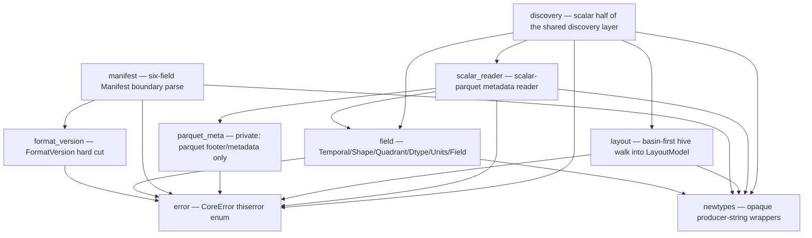

# `hdx-core`

## Purpose

`hdx-core` holds **all contract logic for HDX v0.1** (Hydrology Dataset Exchange) —
the spec and its validator are the same artifact, so the two contract-executing verbs
`validate` and `describe` (spec §10) live here. This is the crate's agent entry-point:
start here to orient before reading `src/`. As of milestone MS1, the crate establishes
the **parse-don't-validate type model** — opaque domain newtypes, the crate-wide
`CoreError`, the `FormatVersion` hard cut, the field 2×2 quadrant model with a closed
`Dtype`, and the six-field `Manifest` boundary parser. Raw input (JSON strings,
producer-chosen strings) is converted into **valid-by-construction** domain types at
the boundary; every type downstream of that boundary is conformant by construction.

As of milestone MS3, the crate adds the **scalar half of the shared discovery layer**
both verbs will stand on (architecture §3.5/§5): the basin-first hive walk
([`layout`](src/layout.rs)), the scalar-parquet **metadata** reader
([`scalar_reader`](src/scalar_reader.rs)), and the single boundary function
([`discovery`](src/discovery.rs)) that ties them into one typed in-memory model. This
layer **reads metadata and 1-D coordinate columns only — never gridded chunks**
(architecture §1) and **records facts, never a verdict** (the §14 conformance checks
are MS6). The **gridded / geometry half** of discovery (COG/Zarr metadata + the
outlines schema) is **MS4**; the `validate` / `describe` verbs themselves land in
later milestones, built on these types.

## Inert and agnostic (load-bearing discipline)

> **HDX describes the *shape* of data, never *what was done to it*** (spec §1).

No type or field in this crate carries — or may ever be extended to carry — a
**transform / normalization** state, a **role** (target / forcing / future-known), a
**semantic type** (continuous / categorical), a **gridded → lumped reduction**, or any
**provenance of computation**. A prediction dataset is just an HDX dataset. Two
concrete consequences enforced by the types here:

- The [`Manifest`](src/manifest.rs) is **exactly six fields** (the §11 floor) — no
  seventh, derivable field (no content hash, no data version, no field catalog, no
  basin list). Everything else is *discovered* from the files, never *declared*.
- [`FormatVersion`](src/format_version.rs) is a **hard cut**: a single-arm enum whose
  parse accepts only `"0.1"`. No multi-version reader is representable.

The MS3 discovery layer holds the same line. The scalar reader catalogs fields **purely
by physical schema** — a column named `streamflow_was_filled` is an *ordinary* field
with no suffix magic, no role, no belongs-to (spec §2). The discovery model adds **no**
manifest-floor field and **no** derivable / role / transform / semantic / provenance
field: the only provenance it records is *which read tier produced an extent*
(`Statistics` vs `BoundedColumnScan`), which is a property of the **read**, not of the
data — never a transform of the values.

Every time a design drifts toward encoding *what was done* or *what the data is for*,
it is wrong.

## Architecture — module map

Each node is a file under `crates/core/src/`. An edge `A --> B` means *module `A`
depends on module `B`*.

The three MS3 modules (`layout` → `scalar_reader` → `discovery`) form the **scalar half
of the discovery layer**; `discovery` is its single boundary function. The `parquet_meta`
node is private (the crate's one parquet touchpoint, R1) — the dashed-from-the-public-API
helper the scalar reader is layered on.

- **`newtypes`** — the leaf: opaque `String` wrappers (`BasinId`, `FieldName`,
  `GridLabel`, `DelineationLabel`, `Crs`, `Cadence`, `DatasetName`, `ProducerVersion`)
  with private fields, so confusion-prone values cannot be swapped at a call site. It
  depends on nothing else in the crate.
- **`error`** — the crate-wide [`CoreError`](src/error.rs); every fallible path
  returns it. Variants use named fields and are doc-commented with *when* they fire;
  several are intentional skeletons reserved for later milestones.
- **`format_version`** — the one contract-version axis, encoded as the hard cut.
- **`field`** — the field model: the two axes as enums, the four quadrants, the closed
  `Dtype` with a fallible boundary parse, opaque `Units`, and `Field` (whose
  constructor enforces `grid_label.is_some()` ⇔ `Shape::Gridded`).
- **`manifest`** — the system boundary: turns a raw `manifest.json` string into a
  valid-by-construction `Manifest` (it depends on `format_version` and `newtypes`).
- **`layout`** (MS3) — the basin-first hive walk: turns a dataset directory into a
  typed [`LayoutModel`](src/layout.rs) — the two **root rollups**' presence facts and
  the enumerated `basin=<id>` directories (folder id parsed out, per-basin artifact
  paths recorded). **Structure-only** (no bytes read inside any artifact); hidden /
  OS-cruft entries are ignored (pre-empts an MS6 L3 false positive). The single
  canonical doc for the cruft filter and the records-facts-not-verdicts stance lives in
  this module's `//!`.
- **`scalar_reader`** (MS3) — the scalar-parquet **metadata** reader: the arrow schema
  mapped to MS1 [`Field`](src/field.rs)s, the `basin_id` column (presence + in-file
  value), the [`time` descriptor](src/scalar_reader.rs), and the **per-basin time
  extent** with its provenance. The single canonical doc for the **LOW-1 bounded
  fallback** and the **MED-5 hand-off** lives in this module's `//!`.
- **`discovery`** (MS3) — the **scalar half** of the shared discovery layer: the typed
  [`ScalarDiscovery`](src/discovery.rs) model and the one boundary function
  [`discover_scalar`](src/discovery.rs) both verbs consume. The single canonical doc for
  the **MS4 seam** (where the gridded / geometry half attaches) lives in this module's
  `//!`.

The committed `schemas/manifest.schema.json` (at the repo root) mirrors the `manifest`
floor; a `jsonschema` dev-dependency test (`tests/manifest_schema.rs`) asserts the
schema and the parser agree, so neither can drift.

## Glossary

Domain terms an agent would not infer from the code alone. Spec section in parentheses.

| Term | Meaning |
|---|---|
| **field** (§2) | The unit of HDX. A scientific variable, a QC mask, a cluster id, and a model prediction are *all just fields*; HDX privileges none. A field carries only `name`, `quadrant`, `dtype`, `units`, and (iff gridded) a `grid_label`. |
| **Temporal** (§2) | The time axis of a field — an enum, never a bool: `Static` (one value) vs `Dynamic` (a time series). |
| **Shape** (§2) | The space axis of a field — an enum, never a bool: `Scalar` (a single value) vs `Gridded` (a per-cell field over the basin bbox). Deliberately *not* "lumped vs gridded": "lumped" smuggles in a reduction, whereas a scalar value (outlet streamflow) is often scalar by nature. |
| **quadrant** (§2) | The product `Temporal × Shape` — one of `ScalarStatic`, `ScalarDynamic`, `GriddedStatic`, `GriddedDynamic`. A **per-field** classification, never a dataset-level mode: one dataset's schema may freely mix all four. |
| **Dtype** (§1, §2) | The physical element encoding (`f32`, `f64`, `i32`, `i64`, `bool`, `timestamp`). A **closed** enum — HDX recognizes exactly these and *rejects* anything else (no `Other(String)`, no panic). It is **opaque to semantics**: HDX records *how a value is encoded*, never *what it means* (continuous/categorical is the consumer's job). |
| **Units** (§1, §2) | An **opaque, optional** producer string — recorded verbatim or absent, never parsed (no unit algebra, no canonicalization, no vocabulary). |
| **basin_id** (§3) | A basin's id, **unique within the dataset** — the only requirement. How it is minted (gauge id, hash, integer, UUID) is the producer's business. It is the authoritative in-file id; a later milestone (MS6) cross-checks it against the `basin=<id>` partition folder. |
| **grid label** (§8) | A stable, producer-chosen name for a *grid family*; the gridded artifact is named after it. A label **shared across the `gridded_static` and `gridded_dynamic` subtrees signals cell-for-cell alignment** — an invariant checked across basins in MS6, not here. |
| **delineation** (§9) | A **neutral** label on each outline polygon (MERIT, GRIT, HydroBASINS, a custom run, a hand-drawn polygon) — *not* assumed to name a published hydrofabric. HDX interprets nothing; disagreement between delineations is itself a modeling signal. |
| **cadence** (§6, §11) | The dataset-wide cadence / calendar convention (e.g. `"daily"`), a declared manifest convention. A non-empty opaque string here; cross-checked against the realized time axes in a later milestone. |
| **manifest floor** (§11) | The manifest is the *irreducible floor*: **exactly six fields** — `format_version`, `name`, `created_at`, `producer_version`, `crs`, `cadence` — and nothing else. Adding any derivable field is a conformance bug, so it is unrepresentable. |
| **`format_version` hard cut** (§0, §11) | `format_version` is read **first** and is a **hard cut**: only `"0.1"` is accepted (exact-string, no numeric coercion — `"0.10"` ≠ `"0.1"`); anything else is rejected outright before any other field is interpreted. |
| **discovery layer (scalar half)** (arch §3.5/§5) | The shared in-memory model both verbs stand on (`describe` *reports* it, `validate` *checks rules over it*). MS3 builds the **scalar half** — basin list, scalar field catalog, per-basin `time` descriptors + extents, `basin_id` observations, root-rollup presence. The **gridded / geometry half** (COG/Zarr metadata + the outlines schema) is **MS4**. The layer **records facts, never a verdict** (§14 enforcement is MS6). |
| **layout model** (§4) | The typed model of one dataset's on-disk **structure** ([`LayoutModel`](src/layout.rs)), produced by the basin-first hive walk: the root-rollup presence facts plus the enumerated `basin=<id>` dirs with per-basin artifact paths. **Structure-only** — no bytes are read inside any artifact (architecture §1). Hidden / OS-cruft entries (`.DS_Store`, `.gitkeep`, dotfiles) are ignored, so working-tree cruft is never enumerated as an HDX path (pre-empts an MS6 L3 stray-file false positive). |
| **root rollup** (§4) | A **dataset-level** artifact at the dataset root (`scalar_static.parquet`, `outlines.geoparquet`) — distinct from the per-basin artifacts under `basin=<id>/`. The asymmetry is principled (size/shape): small dataset-level data rolls up to the root, large per-basin data stays partitioned. MS3 records each rollup's **presence** as a fact (L1 enforcement is MS6); it parses the `scalar_static` schema but only records the `outlines` presence (the outlines schema is MS4). |
| **folder id vs in-file `basin_id`** (§3) | Two ids per basin, recorded **side by side**: the **folder id** parsed from the `basin=<id>` directory name is *locality*; the **in-file `basin_id`** column read from the parquet is *authority*. MS3 surfaces the pair; it does **not** decide agreement (MS6's I2 cross-check does). The in-file value is read via a bounded 1-D key-column read (architecture §1). |
| **time extent** (§6.1) | A basin's `[start, end]` timestamp pair on the `time` axis. Basins may legitimately span **different periods of record** (ragged extents, §6.1) — MS3 surfaces this as a fact, never raised. |
| **time-extent provenance** (§8, arch §7 R3) | Which path produced an extent, recorded on it as an enum (never a `bool`): `Statistics` (the `time` column's row-group min/max from the parquet footer — the primary, no-data-read path, §8) vs `BoundedColumnScan` (the LOW-1 fallback). Downstream (`describe` MS5, `validate` MS6 R3 classification) reports which tier produced each extent. |
| **LOW-1 bounded fallback** (§8, arch §1/§7 R3) | When the `time` column carries **no** row-group statistics, the reader recovers `[min, max]` by reading **exactly one column — `time`, selected by name** (never a data column, never a gridded chunk). It is classified under **R3** as a **metadata/index-tier, architecture-§1-compliant 1-D coordinate read** (the same tier as reading a Zarr `time` coordinate array), **NOT** a gridded-chunk value decode. The bound is hard and stated in [`scalar_reader`](src/scalar_reader.rs)'s `//!`. |
| **MED-5 hand-off** (§8) | The MS2→MS3 writer/reader hand-off: MS2 self-asserted (pyarrow side) that the valid fixture's `time` column carries usable row-group statistics; MS3 **confirms it Rust-side** (a test asserts the statistics are readable by the `parquet` crate **and** that the extent comes from `Statistics`, not the fallback). **The rule:** if Rust ever cannot surface the statistics pyarrow wrote, the fix is to **regenerate the MS2 fixture**, **never** a reader workaround — a mismatch is a generator bug. Stated canonically in [`scalar_reader`](src/scalar_reader.rs)'s `//!`. |
