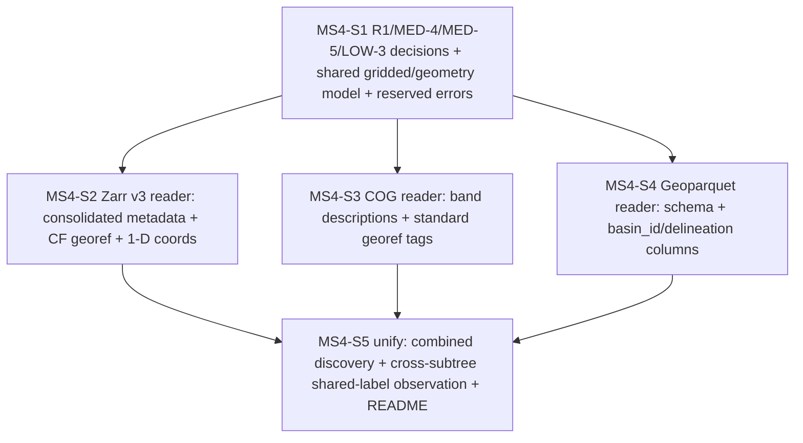

# MS4 — Gridded + geometry metadata readers (discovery layer, gridded/geometry half) — STEP plan

> **Milestone source:** `planning/milestones.md` § "MS4 — Gridded + geometry metadata readers".
> **Planned against:** `architecture.md` §1 (read metadata, not chunks), §3.5 (discovery/report types),
> §5 (validate/describe responsibilities), §7 (R1/R3 risks).
> **Spec contract:** `spec/HDX_SPEC.md` §7, §8, §9; §14 G1–G3, Geo1, I1 (advanced as discovery
> foundations — *enforcement* is MS6).
> **Starting state:** MS1 (types) + MS2 (fixtures) + MS3 (layout walk, scalar parquet reader, scalar
> half of the discovery layer in `crates/core/src/discovery.rs`) are landed and green. This plan
> completes the discovery layer's **gridded + geometry half** and wires it alongside the scalar half.

This file decomposes MS4 into **five** dependency-sequential steps. Each is ONE conventional commit,
each leaves the repo green (`cargo build` + `cargo test` + `cargo clippy --all-targets -- -D warnings`
all pass), and each follows the repo bump+tag convention (`./scripts/bump-version.sh patch`, stage
`Cargo.toml`, commit, `git tag v<version>`).

---

## Ground truth established from the committed MS2 fixture (read before planning)

These on-disk facts (read from `conformance/valid/minimal/basin=0001/`) decide the two high-uncertainty
R1 sub-decisions (MED-4, MED-5) **with evidence**, not by guess:

- **Zarr v3 store** (`gridded_dynamic/era5.zarr/`): the group `zarr.json` carries
  `consolidated_metadata` with `kind: "inline"` — every array's full metadata (the `crs`, `lat`, `lon`,
  `time`, `era5_precipitation`, `era5_precipitation_was_filled` arrays) is **inlined into the one group
  `zarr.json`**. Per-array `zarr.json` files also exist (the non-consolidated path). CF georef is
  present: a scalar `crs` array carries `grid_mapping_name`, `crs_wkt`, `spatial_ref="EPSG:4326"`; the
  data arrays carry `grid_mapping: "crs"`, `units`, and `dimension_names: [time,lat,lon]`; the `lat`/
  `lon`/`time` arrays are 1-D with `standard_name` + `axis`. v3 **sharding** is present
  (`sharding_indexed` codec on the data arrays). → **MED-5 is live** (consolidated path readable).
- **COG** (`gridded_static/era5.tif`): band description `"elevation"` lives in the **GDAL_METADATA tag
  (42112)** as XML — `<Item name="DESCRIPTION" sample="0" role="description">elevation</Item>` — and
  units `"m"` in `<Item name="units" sample="0">m</Item>`. Standard georeferencing is in the GeoKey
  directory (tag 34735 → `EPSG:4326`), ModelPixelScale (33550), ModelTiepoint (33922). The band
  description is **not** in the standard ImageDescription tag (270). All of these are plain TIFF tags
  the pure-Rust `tiff` crate exposes by numeric id. → **MED-4 outcome (1) is live** (pure-Rust read
  works; no GDAL).
- **Geoparquet** (`outlines.geoparquet`): an ordinary parquet with columns `basin_id` (string),
  `delineation` (string), `geometry` (binary WKB, `geoarrow.wkb` extension); a single file at the root
  (not partitioned by delineation); rows `(0001,merit) (0002,merit) (0003,merit) (0001,grit)` — basin
  `0001` has the ≥2-delineation plurality the §9 positive path needs. The schema + the two string
  columns are read with the **same pure-Rust `parquet`/`arrow` path MS3 already uses** — no new geometry
  crate is required for v0.1 (we read the *schema and label columns*, never decode geometries).

---

## Scope guard (read before any step)

MS4 builds **metadata readers only**. Every step in this plan obeys, and no step may break, the
following — they are restated in each step's `acceptance`:

1. **No gridded-chunk decode anywhere in `hdx-core` (LOW-3).** The Zarr reader reads only the array
   **metadata** (`zarr.json` group/array JSON) and the 1-D `time`/`lat`/`lon` **coordinate arrays** +
   CF `grid_mapping`; the COG reader reads only TIFF **tags** (band descriptions + georef); neither ever
   opens a `c/` chunk payload, a shard, or a pixel raster (architecture §1). The `gridded_*` subtrees
   remain **opaque leaves** to the layout walk (already true in `layout.rs`) and **metadata-only** to the
   readers. Where feasible a test asserts this (e.g. the Zarr reader is handed a store whose `c/` chunk
   files are absent/garbage and still succeeds; the COG reader reads tags from a file whose strip/tile
   byte ranges are never touched).
2. **Inert / agnostic — no derivable field, no manifest-floor field.** Every MS4 type carries only
   structural facts (a grid extent/affine/resolution, a CF/GeoTIFF CRS string, a field name = CF
   variable / COG band, a `delineation` label, a `basin_id`). **No** transform, role, semantic type,
   provenance, or reduction field is added anywhere. The six-field `Manifest` is untouched. CRS strings
   are **read and recorded verbatim** — MS4 does not interpret them and does not perform the M5 manifest-
   vs-file cross-check (that rule is MS6; MS4 only *reads* each file's CRS).
3. **Records facts, never a verdict.** MS4 enforces **no** §14 check. It advances G1/G2-precondition/
   G3/Geo1/I1 as *discovery foundations* (it makes the facts available); the rules over them run in MS6.
   A shared grid label across the `gridded_static` (COG) and `gridded_dynamic` (Zarr) subtrees is
   **observed and recorded**, never asserted-as-aligned (G2 enforcement is MS6).
4. **No later-milestone work.** No `describe` assembly/JSON (MS5), no `ValidationReport`/rule engine
   (MS6), no CLI (MS7), no exhaustive invalid fixtures (MS8), no PyO3 (MS9). No `regrid`/`clip`/`reduce`
   ever (spec §10/§13). MS4 stops at "the discovery layer is complete and returns a typed in-memory
   model"; it does not introduce a verb.
5. **Reader/writer mismatch ⇒ regenerate the fixture, never a reader workaround.** If the chosen reader
   cannot read what MS2's generator wrote (a band description, a consolidated-metadata member, a CF
   attr), the fix is an **MS2 regenerate** (write it in a tag/path the reader supports), recorded as an
   amendment — never a special-case in the reader. This mirrors the MS3 MED-5 hand-off discipline.

---

## Ordering rationale

The dependency spine is: **decision + shared model first, then each reader, then the unifying seam.**

- **S1 records the R1 / MED-4 / MED-5 / LOW-3 decisions and stands up the shared gridded/geometry
  data model** (`GridInfo`, the gridded field catalog, the delineation list, the combined-discovery
  shell) plus the reserved error variants. The decisions are *load-bearing inputs* to S2–S4 (they fix
  which crate each reader uses and which read path is "live"), so they must be recorded — in
  `architecture.md`'s Amendments log — before the readers are written. S1 adds **no dependency yet** and
  introduces only types that S5 will consume, so it stays green by being exercised in unit tests (the
  types are constructed and their accessors asserted) — the same "exercise, don't just declare" pattern
  MS3-S1 used for `parquet_meta`.
- **S2 (Zarr) before S3 (COG)** because the Zarr reader resolves the **MED-5 consolidated-metadata
  gate** — the single highest-value R1/§8 question — and establishes the `GridInfo` shape (extent/
  affine/resolution from 1-D `lat`/`lon` coordinate arrays + CF `grid_mapping`) that the COG reader then
  mirrors for the static grid. Doing Zarr first means the COG reader has a settled `GridInfo` target.
- **S3 (COG) before S4 (geometry)** because COG resolves the **MED-4 band-description gate** (the other
  high-uncertainty pure-Rust read) and completes the *gridded* field catalog (the `gridded·static`
  fields) that pairs with S2's `gridded·dynamic` fields under a shared grid label. Geometry (S4) is
  independent of both gridded readers (it reuses MS3's parquet path) and is sequenced last among the
  three readers because it is the lowest-risk and feeds only the `delineations` list + the outlines
  `basin_id`/schema facts.
- **S5 unifies** the three readers behind one boundary function alongside the MS3 scalar half — the
  point where the **shared grid label is observed across the static (COG) and dynamic (Zarr) subtrees**
  (the G2 precondition), the combined discovery model is finalized, and the crate README's module map +
  glossary are updated. S5 is last because it depends on all three readers existing.

Each step is independently committable: S1 ships exercised types; S2/S3/S4 each ship a working reader
with fixture-backed tests; S5 ships the unifying function. After every step the full discovery layer
that exists so far is internally consistent and green.

---

## Dependency graph

---

## MS4-S1 — R1/MED-4/MED-5/LOW-3 decisions recorded + shared gridded/geometry discovery model

**id:** MS4-S1

**Intent.** Land the *decisions* MS4 turns on — recorded in `architecture.md`'s Amendments log so a
future agent reads them next to the body text they revise — and the **inert/agnostic shared data model**
the three readers (S2–S4) will populate and the seam (S5) will assemble. This is the floor the rest of
MS4 stands on, independently committable because the new types are exercised by unit tests (constructed,
accessors asserted) and the amendment is pure documentation; the repo stays green with no new dependency
yet (each reader adds its own crate when it has a live consumer, mirroring MS3-S1's `parquet_meta`
touchpoint). It does a milestone-meaningful unit: it freezes the gridded/geometry half's type shapes and
the R1 crate choices so S2–S4 cannot drift.

**Changes.**
- `crates/core/src/gridded.rs` (new): the shared **gridded/geometry discovery model**, all inert:
  - `GridInfo` — per grid label: the `GridLabel`, the 1-D extent (`lat`/`lon` min/max as recorded
    coordinate bounds), resolution (cell size derived from the coordinate spacing — a structural fact of
    the grid, **not** a transform of values), the affine origin/step, the CF/GeoTIFF `Crs` string read
    verbatim, and the grid's `[time?,lat,lon]` shape. Accessors only; private fields. Doc-comment: this
    is a *structural* description of the grid, never a regrid target.
  - `GriddedField` *or* reuse of MS1 `Field` — gridded fields are catalogued as MS1 `Field`s
    (`Quadrant::GriddedDynamic` for Zarr variables, `Quadrant::GriddedStatic` for COG bands) with a
    `Some(GridLabel)` (the `Field::new` invariant already enforces gridded ⇒ label). No new field type
    is needed for the catalog itself; `GridInfo` is the new per-label descriptor.
  - `GriddedDiscovery` — the gridded/geometry half: `grids: Vec<GridInfo>`, the gridded field catalog
    (`Vec<Field>`), `delineations: Vec<DelineationLabel>`, and the per-basin gridded facts container
    (the seam S2–S4 fill). Accessors only.
  - A `GridGeoref` (or inline fields on `GridInfo`) recording **CF/GeoTIFF georef presence** (the G3
    discovery foundation): whether a `grid_mapping`/CRS was found, recorded as an enum, never a bare
    bool where a richer state exists. (Enums-over-booleans, architecture §3.3.)
- `crates/core/src/error.rs`: add reserved `thiserror` variants (named fields, each doc-commented with
  *when* it fires) for the readers S2–S4 will raise:
  - `ZarrRead { artifact, detail }` — a present Zarr store cannot be opened or its metadata fails to
    decode (S2).
  - `CogRead { artifact, detail }` — a present COG cannot be opened or its TIFF tags fail to decode (S3).
  - `GeoparquetRead { artifact, detail }` — `outlines.geoparquet` cannot be read or its metadata fails
    to decode (S4) — *or* reuse `ParquetRead` and document the reuse; pick one and state it.
  - `MissingOutlinesColumn { column }` — `outlines.geoparquet` lacks a structurally required column
    (`basin_id` / `delineation` / `geometry`) (S4, Geo1 discovery foundation).
  Keep the `#[non_exhaustive]` enum stable; do not reshape MS3 variants.
- `crates/core/src/lib.rs`: `pub mod gridded;` and the module-map `//!` line (the README mermaid map is
  updated in S5, after the readers exist).
- `architecture.md` Amendments log (newest-first): one dated entry recording all four decisions:
  - **R1 (Zarr):** pure-Rust `zarrs` (or a minimal hand-rolled `zarr.json` reader) for Zarr v3 metadata
    + 1-D coordinate arrays; pinned. No GDAL. Record the exact crate + major version chosen in S2.
  - **R1 (COG):** pure-Rust `tiff` crate; band descriptions read from **GDAL_METADATA tag 42112** XML
    (`<Item ... role="description">` and `<Item name="units">`), georef from the GeoKey directory.
    No GDAL.
  - **R1 (geometry):** **no new crate** — read `outlines.geoparquet`'s schema + `basin_id`/`delineation`
    string columns via the existing `parquet`/`arrow` stack; geometries are never decoded in v0.1.
  - **MED-4 (band descriptions) — outcome (1) recorded with evidence:** pure-Rust read works (the
    fixture proves the band description is in tag 42112, an ASCII tag the `tiff` crate exposes), so the
    G1 COG-side check is **metadata-deep and live**. The entry MUST state explicitly: GDAL was **not**
    reintroduced; if a *future* fixture surfaces a band description the `tiff` crate cannot reach, the
    fix is an MS2 regenerate (write it where the reader can read it), and only if *that* is impossible
    do outcomes (2)/(3) apply — (2) accept GDAL **and** re-confirm the MS9 maturin/PyO3 wheel still
    builds with the system dependency, recorded as an amendment; (3) reject GDAL and report the COG
    band-name check as an **R3 byte/format-deep SKIP-with-reason**, never silently claimed. The decision
    tree is recorded so a future agent sees all three named outcomes and why (1) was chosen.
  - **MED-5 (consolidated metadata) — live, recorded:** the fixture's Zarr v3 group `zarr.json` exposes
    inline `consolidated_metadata` (§8 one-read-to-learn-the-store), confirmed **from the Rust side** in
    S2; the reader reads via the consolidated path. The entry states the fallback: if a future store
    lacks consolidated metadata, the reader falls back to per-array `zarr.json` reads and the
    **consolidated-metadata/v3-sharding *verification*** is classified as an **R3 byte-deep
    SKIP-with-reason** (documented, never silently claimed). A zarr-python vs Rust mismatch ⇒ regenerate
    the MS2 fixture, never a reader workaround.
  - **LOW-3 (no-chunk-decode discipline):** state that no gridded-chunk decode happens anywhere in
    `hdx-core` — the gridded readers read array metadata + 1-D coordinate arrays + CF `grid_mapping`
    (Zarr) and TIFF tags + georef (COG), never `c/` chunk payloads, shards, or pixel rasters
    (architecture §1); the `gridded_*` subtrees are opaque leaves to the walk and metadata-only to the
    readers. This becomes a recurring review gate for S2/S3 and an asserted property where feasible.

**Test plan.**
- Unit tests in `gridded.rs`: construct a `GridInfo` and a `GriddedDiscovery` by hand; assert every
  accessor round-trips the value set; assert a gridded `Field` requires a `GridLabel` (already enforced
  by `Field::new`, asserted here for the catalog path).
- Unit test (or extend `lib.rs`'s `every_core_error_variant_constructs`): construct each new reserved
  error variant and assert a non-empty `Display`.
- A doc-level / inert-discipline test or `#[doc]` assertion: the `GriddedDiscovery` / `GridInfo` public
  surface exposes **no** field whose name or type implies transform/role/semantic/provenance/reduction
  (compile-level: the struct simply has no such field; a comment + the accessor list pin it).

**Acceptance.**
- `cargo build`, `cargo test`, `cargo clippy --all-targets -- -D warnings` all pass (no dead-code
  warnings: every new type is constructed and asserted in a test).
- `architecture.md` Amendments log carries the dated MS4-S1 entry recording **R1 (Zarr/COG/geometry),
  MED-4 (three named outcomes; outcome (1) chosen with fixture evidence; GDAL not reintroduced), MED-5
  (consolidated path live + the R3 fallback), and LOW-3 (no-chunk-decode)**. The MS2-regenerate-not-
  reader-workaround rule is stated for both MED-4 and MED-5.
- The shared gridded/geometry model (`GridInfo`, `GriddedDiscovery`, the georef-presence enum) and the
  reserved error variants exist, are inert/agnostic (no derivable/role/transform/semantic/provenance
  field; six-field `Manifest` untouched), and are exercised by tests.
- Spec MUST-checks advanced (foundation scaffolding only; enforcement is MS6): **G1/G2-precondition/G3/
  Geo1/I1** type surface defined; no check enforced.
- Commit via `./scripts/bump-version.sh patch` + stage `Cargo.toml` + conventional commit + `git tag`.

**Spec refs.** §7 (per-variable native grids; CF/GeoTIFF georef; one dataset-wide CRS), §8 (one
artifact = one grid; self-naming; shared grid label ⇒ alignment; Zarr v3 sharding + consolidated
metadata), §9 (plural outlines; `delineation`), §14 G1–G3/Geo1/I1; architecture §1, §3.5, §7 (R1, R3).

**Commit message.** `feat(core): record MS4 R1/MED-4/MED-5/LOW-3 decisions and add the gridded/geometry discovery model`

---

## MS4-S2 — Zarr v3 reader: consolidated metadata + CF georef + 1-D coordinate arrays

**id:** MS4-S2

**Intent.** Read the `gridded_dynamic/<label>.zarr` store's **metadata** into the shared model: the named
CF variables (= `gridded·dynamic` field names), the 1-D `time`/`lat`/`lon` coordinate arrays, the CF
`grid_mapping`/CRS, per-variable units, and the grid extent/affine/resolution — **via the §8
consolidated-metadata path (MED-5, live)**. Independently committable: it ships a working reader with
fixture-backed tests and resolves the highest-value R1/§8 question.

**Changes.**
- `crates/core/Cargo.toml`: add the Zarr metadata dependency chosen in S1 (pure-Rust; pinned major;
  `default-features` minimized to metadata + local-filesystem reads — no async, no object_store, no
  chunk codecs we do not need). If `zarrs`' surface pulls in chunk-decode machinery that is heavy or
  forces unwanted features, the recorded fallback is a **minimal hand-rolled `zarr.json` reader**
  (serde over the group/array JSON, which is plain JSON as the fixture shows) — decide in this step and
  record the final crate + version in the S1 amendment entry (amend it). Whichever is chosen, the dep
  has a **live consumer in this same commit** (the reader), so no dead-code allowance is needed.
- `crates/core/src/zarr_reader.rs` (new): `read_zarr_grid(path) -> Result<ZarrGrid, CoreError>` (names
  illustrative), reading **metadata only**:
  - Open the store's group `zarr.json`; **read its inline `consolidated_metadata`** (MED-5 live path —
    one read learns the store, §8). If consolidated metadata is absent, fall back to reading each array's
    `zarr.json` and classify consolidated-metadata/sharding *verification* as an **R3 byte-deep
    SKIP-with-reason** (recorded on the returned model as an honest fact, never a silent claim).
  - Enumerate the **data arrays** (those carrying `dimension_names`/`_ARRAY_DIMENSIONS` of `[time,lat,
    lon]`, e.g. `era5_precipitation`, `era5_precipitation_was_filled`) → one MS1 `Field` each
    (`Quadrant::GriddedDynamic`, dtype via the MS1 `parse_dtype` over the Zarr `data_type` string mapped
    through a documented bridge mirroring `scalar_reader::arrow_dtype_str`, units from the CF `units`
    attr, `grid_label` = the artifact's grid label from its file name). The CF variable name **is** the
    field name (G1 self-naming; no positional channel axis — recorded as a fact).
  - Read the 1-D **coordinate arrays** `lat`/`lon`/`time` (their shape + their stored values via the
    coordinate-array metadata/inline values — a 1-D coordinate read, the architecture-§1 metadata tier,
    **never** a `c/` data chunk) to compute the `GridInfo` extent/affine/resolution.
  - Read the CF **`grid_mapping`** (the `crs` array's `grid_mapping_name`/`crs_wkt`/`spatial_ref`) into
    the `Crs` string + the georef-presence enum (G3 discovery foundation), recorded verbatim (no M5
    cross-check here).
  - Return the per-store `GridInfo` + the gridded·dynamic `Field`s + the consolidated-metadata-path-used
    fact + the sharding-present fact (read from the codec list as metadata, recorded; **not** byte-
    verified — sharding *verification* stays an R3 byte-deep item).
- Typed errors: `ZarrRead` for an unreadable/undecodable store; `UnknownDtype` for a Zarr `data_type`
  with no HDX mapping; `MissingScalarColumn`-analogue or a Zarr-specific variant if a structurally
  required coordinate (`time`/`lat`/`lon`) is absent — pick and document.

**Test plan.**
- Against `conformance/valid/minimal/basin=0001/gridded_dynamic/era5.zarr`:
  - the two CF variables are discovered as `GriddedDynamic` `Field`s named exactly `era5_precipitation`
    and `era5_precipitation_was_filled` (the `_was_filled` companion-mask name is an **ordinary** field —
    no suffix magic, asserted; spec §2);
  - `lat`/`lon`/`time` 1-D coordinate arrays drive a `GridInfo` with the expected extent (lat over 8
    cells, lon over 6 cells, 0.25° step from the fixture) and CRS `EPSG:4326`;
  - the CF `grid_mapping` is found and the georef-presence enum reports present (G3 foundation);
  - **MED-5 live assertion:** the reader reports it read via the **consolidated-metadata path** on this
    fixture (mirrors MS2's consolidated-metadata self-check and the MS3 MED-5 hand-off discipline);
  - **MED-5 hand-off rule, Rust-side confirmation:** a test asserts the Rust reader can read the
    consolidated metadata zarr-python wrote; if it ever cannot, the documented fix is an MS2 regenerate,
    not a reader workaround (stated in the module `//!` and exercised by this test).
  - sharding is **observed** in the codec metadata (recorded fact), not byte-verified (the R3 line).
- **LOW-3 no-chunk-decode assertion (where feasible):** a test copies the store's `zarr.json`(s) into a
  temp dir **without** any `c/` chunk files (or with garbage chunk bytes) and asserts the reader still
  returns the full `GridInfo` + field catalog — proving the reader never touches a chunk payload.
- Negative: a directory that is not a Zarr store / a corrupt `zarr.json` → `CoreError::ZarrRead`.
- A unit test mapping each Zarr `data_type` string the bridge supports (`float32`/`float64`/`int8`?/
  `int32`/`int64`/`bool`) to its `Dtype`, and rejecting an unmapped one with `UnknownDtype`. (Note: the
  `_was_filled` mask is `int8` in the fixture — if `int8` is not in MS1's closed `Dtype`, this surfaces
  a closed-enum gap: handle per the MS1 policy — typed-error-first — and record any `Dtype` addition as
  an architecture amendment; do **not** silent-default.)

**Acceptance.**
- `cargo build`, `cargo test`, `cargo clippy --all-targets -- -D warnings` all pass.
- The Zarr reader reads the fixture's metadata via the **§8 consolidated-metadata path (MED-5 live)**;
  the consolidated-path-used fact is recorded on the returned model and asserted in a test. The R3
  fallback (per-array reads + sharding/consolidated *verification* as a byte-deep skip-with-reason) is
  implemented and documented for stores without consolidated metadata.
- **LOW-3 asserted:** the reader provably reads no `c/` chunk payload (the no-chunks test passes); the
  module `//!` states the no-chunk-decode discipline.
- Inert/agnostic: the returned model carries only structural facts (grid extent/affine/res, CRS string,
  field names + dtypes + units); no transform/role/semantic/provenance/reduction field; `Manifest`
  untouched. The `_was_filled` variable is an ordinary field.
- Spec MUST-checks advanced (discovery foundations; enforcement MS6): **G1** (self-naming CF variables;
  no positional channel axis), **G3** (CF `grid_mapping`/CRS present), and the per-store half of the
  **G2 precondition** (the grid label read from the artifact name).
- Commit via the bump+tag convention.

**Spec refs.** §7 (per-variable native grids; CF georef; one dataset-wide CRS), §8 (Zarr v3, sharding,
consolidated metadata, self-naming variables), §2 (ordinary fields / companion masks), §14 G1/G3 +
G2-precondition; architecture §1, §7 (R1, R3).

**Commit message.** `feat(core): add Zarr v3 metadata reader over the consolidated path (MED-5 live, no chunk decode)`

---

## MS4-S3 — COG reader: band descriptions (GDAL_METADATA tag 42112) + standard georef tags

**id:** MS4-S3

**Intent.** Read the `gridded_static/<label>.tif` multiband COG's **tags** into the shared model: the
per-band descriptions (= `gridded·static` field names), per-band units, and the standard
georeferencing (CRS + extent/affine/resolution) — **pure-Rust, no GDAL (MED-4 outcome (1), live)**.
Independently committable: a working reader with fixture-backed tests that resolves the second high-
uncertainty R1 read.

**Changes.**
- `crates/core/Cargo.toml`: add the pure-Rust `tiff` crate (pinned major; minimal features). Live
  consumer (the reader) in the same commit.
- `crates/core/src/cog_reader.rs` (new): `read_cog_grid(path) -> Result<CogGrid, CoreError>`, reading
  **tags only**:
  - Open the TIFF; read the **GDAL_METADATA tag (42112)** ASCII XML and parse the `<Item>` entries:
    `role="description"` → band description (= field name); `name="units"` → band units; keyed by the
    `sample="N"` band index. (The fixture's single band: `DESCRIPTION=elevation`, `units=m`.) Parse the
    XML with a **minimal, dependency-light** approach (a tiny hand parser over the `<Item>` tags, or a
    small XML crate if one is already justified — prefer no new XML dependency; the GDALMetadata grammar
    is tiny and fixed). Each band → one MS1 `Field` (`Quadrant::GriddedStatic`, dtype via a documented
    TIFF `SampleFormat`+`BitsPerSample` → `Dtype` bridge, units from the parsed `units` item, `grid_label`
    = the artifact grid label from the file name).
  - Read the **standard georef tags**: GeoKeyDirectory (34735) → CRS (`EPSG:4326` in the fixture),
    ModelPixelScale (33550) → resolution, ModelTiepoint (33922) → origin → the `GridInfo` extent/affine.
    Record the `Crs` verbatim + the georef-presence enum (G3 foundation). No M5 cross-check here.
  - The reader reads **only the primary IFD's tags** (and ignores overview IFDs for the field catalog) —
    it never reads strip/tile byte ranges (no pixel decode). Multiband: iterate the `<Item>` entries by
    `sample` to catalog every band's description = field name (G1 self-naming; band description = field
    name, spec §8).
- Typed errors: `CogRead` for an unreadable/undecodable TIFF or a missing/garbled GDAL_METADATA tag when
  a band description is structurally required; `UnknownDtype` for an unmappable TIFF sample format.

**Test plan.**
- Against `conformance/valid/minimal/basin=0001/gridded_static/era5.tif`:
  - the band description `elevation` is read from tag 42112 → one `GriddedStatic` `Field` named exactly
    `elevation`, dtype `f32` (the fixture's `float32`), units `m`, `grid_label` = `era5`;
  - the standard georef is read: CRS `EPSG:4326`, the `GridInfo` extent/affine/resolution from
    ModelPixelScale + ModelTiepoint (0.25° cells; origin from the tiepoint), georef-presence reports
    present (G3 foundation);
  - **MED-4 round-trip (the load-bearing assertion):** the reader reads the **exact band description the
    MS2 generator wrote** (`elevation`) from the tag the writer used (42112). If this fails, the test
    documents that the fix is an **MS2 regenerate** (write the description in a tag the `tiff` reader
    supports), **never** a reader workaround, and **never** a silent GDAL reintroduction — per the S1
    amendment's MED-4 decision tree.
- **LOW-3 no-pixel-decode assertion (where feasible):** assert the reader returns the full band catalog +
  georef from a file whose pixel/strip bytes are never read (e.g. truncate/garble the strip data offset
  region in a temp copy and assert tag reading still succeeds) — proving tags-only, no raster decode.
- A unit test for the GDALMetadata `<Item>` parser: a hand-built XML string with multiple bands
  (`sample="0"`, `sample="1"`, descriptions + units) parses to the right per-band (description, units)
  pairs; malformed XML → a typed `CogRead` (no panic).
- A unit test for the `SampleFormat`/`BitsPerSample` → `Dtype` bridge (e.g. IEEE-float 32 → `f32`),
  rejecting an unmapped combination with `UnknownDtype`.
- Negative: a non-TIFF / corrupt file → `CoreError::CogRead`.

**Acceptance.**
- `cargo build`, `cargo test`, `cargo clippy --all-targets -- -D warnings` all pass.
- **MED-4 outcome (1) is live and round-trip-verified:** the pure-Rust `tiff` reader reads the band
  description (and units) the MS2 generator wrote, from tag 42112 — so the **G1 COG-side check is
  metadata-deep and live**. GDAL is **not** reintroduced. The S1 amendment's three-outcome decision tree
  governs any future failure (regenerate fixture first; only then (2) GDAL-with-MS9-wheel-reconfirm or
  (3) R3 skip-with-reason — never a silent GDAL dependency).
- **LOW-3 asserted:** the reader provably reads no pixel/strip/tile payload (tags only); the module `//!`
  states the no-raster-decode discipline.
- Inert/agnostic: the returned model carries only structural facts (band name, units, dtype, grid
  extent/affine/res, CRS string); no transform/role/semantic/provenance/reduction field; `Manifest`
  untouched.
- Spec MUST-checks advanced (discovery foundations; enforcement MS6): **G1** (band description = field
  name; no positional channel axis), **G3** (GeoTIFF georef present), and the COG half of the **G2
  precondition** (the grid label read from the artifact name).
- Commit via the bump+tag convention.

**Spec refs.** §7 (per-variable native grids; standard GeoTIFF georef; one dataset-wide CRS), §8 (multi-
band COG; band description = field name; self-naming), §14 G1/G3 + G2-precondition; architecture §1, §7
(R1 COG decision, R3).

**Commit message.** `feat(core): add pure-Rust COG metadata reader for band descriptions and georef (MED-4 live, no GDAL)`

---

## MS4-S4 — Geoparquet reader: outlines schema + basin_id/delineation columns (not partitioned)

**id:** MS4-S4

**Intent.** Read `outlines.geoparquet`'s **schema and label columns** into the shared model: confirm the
`(basin_id, delineation, geometry)` schema, read the `delineation` labels and the outlines `basin_id`
column, and record the structural "single file at root, not partitioned by delineation" fact — reusing
the **existing pure-Rust `parquet`/`arrow` path** (no new geometry crate; geometries are never decoded
in v0.1). Independently committable: a working reader with fixture-backed tests, feeding the
`delineations` list and the outlines `basin_id`/schema facts.

**Changes.**
- `crates/core/Cargo.toml`: **no new dependency** (reuses `parquet`/`arrow` from MS3 — record this as the
  R1-geometry decision in the S1 amendment).
- `crates/core/src/outlines_reader.rs` (new): `read_outlines(path) -> Result<OutlinesTable, CoreError>`,
  reading **metadata + the two 1-D string columns only**:
  - Read the arrow schema; assert the presence of `basin_id` (string), `delineation` (string),
    `geometry` (binary/WKB) columns as **facts** (Geo1 discovery foundation: schema is
    `(basin_id, delineation, geometry)`; the `delineation` label column exists). A missing required
    column is recorded via `MissingOutlinesColumn` (a structural read failure) — but the *rule* "these
    columns MUST exist" is MS6; MS4 records what it finds and raises only on an unreadable file.
  - Read the `delineation` column (a bounded 1-D string-column read, same mechanism as MS3's `basin_id`
    read) → the distinct `DelineationLabel`s (e.g. `merit`, `grit` from the fixture). Read the outlines
    `basin_id` column (the I1-in-outlines discovery foundation) → the distinct ids.
  - Record "not partitioned by delineation" structurally: `outlines.geoparquet` is a **single file at the
    dataset root** (the layout walk already records this), so the reader notes it read one file (no
    `delineation=<...>/` partition dirs) — a recorded fact, not an enforced rule.
  - **Never decode geometries** (the `geometry` WKB column is recorded as present by schema only; its
    bytes are not read) — the geoparquet analogue of the LOW-3 no-chunk-decode discipline.
- Typed errors: `GeoparquetRead` (or documented `ParquetRead` reuse) for an unreadable/undecodable file;
  `MissingOutlinesColumn` for a structurally required column absent.

**Test plan.**
- Against `conformance/valid/minimal/outlines.geoparquet`:
  - the schema is read and the three columns (`basin_id`, `delineation`, `geometry`) are found (Geo1
    foundation);
  - the `delineation` labels are `{merit, grit}` (distinct, in first-seen order), proving the §9
    plurality — basin `0001` has both `merit` and `grit`;
  - the outlines `basin_id` column yields `{0001, 0002, 0003}` (I1-in-outlines foundation);
  - the geometry column is recorded present **by schema only** — a test asserts the reader did not decode
    WKB (no geometry crate is linked; the WKB bytes are untouched).
- Negative: a parquet missing the `delineation` column → `MissingOutlinesColumn { column: "delineation" }`;
  a non-parquet / corrupt file → `GeoparquetRead`.
- Reuse pattern check: a test confirms the reader uses the same `parquet`/`arrow` metadata path as MS3
  (no new dependency added — verified by `Cargo.toml` diff being empty for deps in this step).

**Acceptance.**
- `cargo build`, `cargo test`, `cargo clippy --all-targets -- -D warnings` all pass.
- The geoparquet reader reads the `(basin_id, delineation, geometry)` schema, the `delineation` labels,
  and the outlines `basin_id` column from the fixture, all as **facts** (no Geo1/I1 rule enforced —
  that is MS6). The "single file at root, not partitioned" fact is recorded.
- **No new dependency** (R1-geometry = reuse `parquet`/`arrow`); geometries are never decoded (the
  geoparquet analogue of LOW-3).
- Inert/agnostic: the returned model carries only structural facts (column presence, `delineation`
  labels, `basin_id` values); no transform/role/semantic/provenance/reduction field; `Manifest`
  untouched.
- Spec MUST-checks advanced (discovery foundations; enforcement MS6): **Geo1** (outlines schema +
  `delineation` column; not partitioned), **I1** (`basin_id` present in outlines).
- Commit via the bump+tag convention.

**Spec refs.** §9 (plural outlines; rows `(basin_id, delineation, geometry)`; `delineation` label
column; one dataset-level file, not partitioned by delineation), §3 (`basin_id`), §14 Geo1/I1;
architecture §1, §7 (R1 geometry decision).

**Commit message.** `feat(core): add geoparquet outlines reader for schema, delineation, and basin_id (no geometry decode)`

---

## MS4-S5 — Unify: combined discovery + cross-subtree shared-grid-label observation + README

**id:** MS4-S5

**Intent.** Complete the shared discovery layer: a single boundary function assembles the gridded/
geometry half (S2 Zarr + S3 COG + S4 geometry) **alongside** the MS3 scalar half, into one typed
in-memory model both verbs (MS5/MS6) will consume — and observe the **shared grid label across the
`gridded_static` (COG) and `gridded_dynamic` (Zarr) subtrees** (the G2 precondition). Independently
committable: it ties the three readers together behind one function, finalizes the combined model, and
updates the crate README's module map + glossary. This is the milestone's reviewable outcome: the
discovery layer is now complete.

**Changes.**
- `crates/core/src/gridded.rs` (or a new `discovery` sibling): `discover_gridded(layout) ->
  Result<GriddedDiscovery, CoreError>` — walks each basin's recorded `gridded_static` / `gridded_dynamic`
  subtree paths (already on the MS3 `LayoutModel`/`BasinDir`), invokes `read_cog_grid` /
  `read_zarr_grid` per present artifact and `read_outlines` once at the root, and assembles:
  - the per-grid-label `Vec<GridInfo>` (deduplicated/representative per label, spec §7.2 — each field
    keeps its own native grid; the representative is recorded per label);
  - the gridded field catalog (`GriddedDynamic` Zarr variables + `GriddedStatic` COG bands), ordinary
    fields, companion-mask (`_was_filled`) and `{source}_{variable}` (`era5_precipitation`) names
    catalogued with **no special handling** (spec §2);
  - the `delineations` list from S4;
  - the **shared-grid-label observation**: when the same grid label appears in both the `gridded_static`
    (COG) and `gridded_dynamic` (Zarr) subtrees (the fixture's `era5` label appears in both), record it
    as the **G2 precondition fact** — observed across subtrees, **not** asserted-as-aligned (G2
    enforcement is MS6).
  - Surfaces gaps as facts (a basin with no gridded subtree records an empty gridded contribution; a
    scalar-only dataset yields an empty `grids`/gridded catalog) — never a verdict.
- A combined-discovery shape (either a `Discovery` struct holding the MS3 `ScalarDiscovery` + this
  `GriddedDiscovery`, or documenting that MS5 composes the two halves). Keep MS3's `ScalarDiscovery`
  **unreshaped** — the gridded half sits alongside it (the MS3 "MS4 seam" contract).
- `crates/core/src/lib.rs`: export the new function(s); update the module-map `//!` lines for the three
  new reader modules + the gridded model.
- `crates/core/README.md`: extend the **Mermaid module map** with `zarr_reader`, `cog_reader`,
  `outlines_reader`, `gridded` and their edges (→ `error`, `newtypes`, `field`, `parquet_meta`/the
  parquet stack); add a "MS4 — gridded/geometry half complete" paragraph (mirroring the MS3 paragraph);
  extend the **glossary** with: GridInfo / native grid (§7.2), CF `grid_mapping` (§7.3), consolidated
  metadata (§8, MED-5 live), v3 sharding (observed, R3-verification deferred), COG band description = field
  name (§8, MED-4 live, tag 42112), shared-grid-label observation (§8, G2 precondition), the LOW-3
  no-chunk-decode discipline, and the geoparquet-schema/`delineation` facts (§9).

**Test plan.**
- Against `conformance/valid/minimal/` (the whole dataset):
  - `discover_gridded` returns the `era5` `GridInfo`, the gridded field catalog (`elevation` static +
    `era5_precipitation`/`era5_precipitation_was_filled` dynamic), and `delineations = {merit, grit}`;
  - **G2 precondition observed:** the `era5` grid label appears in **both** the COG (`gridded_static`)
    and the Zarr (`gridded_dynamic`) subtrees and is recorded as the cross-subtree shared-label fact
    (read, not enforced) — the on-disk precondition MS6's G2 positive path fires on;
  - the gridded fields are ordinary (the `_was_filled` and `era5_precipitation` names get no special
    handling — asserted);
  - the combined discovery model exposes the MS3 scalar half **unreshaped** (the MS3 seam accessors still
    hold) alongside the new gridded/geometry half — a compile + shape test pins this.
- A scalar-only / no-gridded path: `discover_gridded` over a synthesized layout with no `gridded_*`
  subtrees yields an empty `grids` + empty gridded catalog (gap-as-fact), proving artifacts-from-fields
  derivation does not require gridded subtrees (architecture §3.3).
- **LOW-3 layer-level assertion:** a test (or the existing per-reader no-chunk tests, referenced here)
  documents that the unified walk reads only metadata across all three readers — the `gridded_*` subtrees
  are opaque leaves to the layout walk (already asserted in `layout.rs`) and metadata-only to the readers.
- The README's mermaid map compiles (a doc/build sanity check; the existing `manifest_schema`-style test
  pattern is not required, but the README must reflect the real module graph).

**Acceptance.**
- `cargo build`, `cargo test`, `cargo clippy --all-targets -- -D warnings` all pass.
- The **discovery layer is complete**: one boundary function assembles the gridded/geometry half
  alongside the MS3 scalar half into a combined typed in-memory model both verbs (MS5/MS6) can consume;
  MS3's `ScalarDiscovery` is unreshaped.
- The **shared grid label is observed across the static (COG) and dynamic (Zarr) subtrees** and recorded
  as the **G2 precondition** fact (read, not enforced).
- Spec MUST-checks advanced (discovery foundations; enforcement MS6): **G1** (self-naming across both
  artifact kinds), **G2-precondition** (shared label observed across subtrees), **G3** (CF/GeoTIFF
  georef present), **Geo1** (outlines schema + `delineation`), **I1** (basin_id in outlines).
- **LOW-3 holds at the layer level:** no gridded-chunk decode anywhere in `hdx-core` (asserted by the
  per-reader no-chunk tests and stated in the module docs + README glossary).
- Inert/agnostic: the combined model adds no derivable/role/transform/semantic/provenance/reduction
  field; the six-field `Manifest` is untouched.
- `crates/core/README.md` module map + glossary updated to reflect the complete discovery layer.
- Commit via the bump+tag convention.

**Spec refs.** §2 (ordinary fields / companion masks across gridded artifacts), §7 (per-variable native
grids; CF/GeoTIFF georef; one CRS), §8 (one artifact = one grid; self-naming; shared grid label ⇒
alignment), §9 (plural outlines; `delineation`), §14 G1/G2-precondition/G3/Geo1/I1; architecture §1,
§3.5 (the unified discovery model), §5 (the shared layer both verbs consume), §7 (R1, R3).

**Commit message.** `feat(core): complete the discovery layer with the unified gridded/geometry half and shared-label observation`

---

## Coverage check — every MS4 deliverable / exit criterion / spec ref is assigned

| MS4 deliverable / exit criterion (from milestones.md) | Step(s) |
|---|---|
| R1 decision (Zarr/COG/geometry) recorded as an architecture amendment | S1 (recorded) + S2/S3/S4 (each pins its crate/version) |
| Zarr reader: per-grid metadata, `time`/`lat`/`lon` 1-D coords, CF `grid_mapping`/CRS, units, extent/affine/res | S2 |
| §8 consolidated-metadata gate: read via the consolidated path **OR** R3 byte-deep skip-with-reason | S1 (decision) + S2 (live consolidated path + R3 fallback) |
| §8 v3 sharding: observed (recorded) vs *verification* (R3 byte-deep) classified | S1 (decision) + S2 (observed; verification deferred to R3) |
| COG reader: band descriptions = field names, standard georef tags, extent/affine/res, units | S3 |
| Geoparquet reader: `(basin_id, delineation, geometry)` schema, `delineation` column, `basin_id`, not partitioned | S4 |
| Reader output feeds the unified discovery model (`GridInfo`, delineations, gridded catalog) shared with the scalar half | S1 (model) + S5 (assembly) |
| Tests: Zarr CF lat/lon + grid_mapping; COG bands + georef; shared grid label observed across subtrees; geoparquet schema + labels; `{source}_{variable}` gridded field ordinary | S2 (Zarr), S3 (COG), S4 (geometry), S5 (shared-label + ordinary across both) |
| Discovery layer complete (both verbs can assemble from one typed model) | S5 |
| Spec MUST-checks advanced: G1, G3, G2-precondition, Geo1, I1 | G1/G3/G2-precond: S2+S3; Geo1/I1: S4; unified G1/G2-precond/G3/Geo1/I1: S5 |
| MED-4 (band-description decision; three named outcomes; outcome (1) chosen; GDAL not reintroduced; regenerate-not-workaround) | S1 (decision tree recorded) + S3 (round-trip verified live) |
| MED-5 (Rust-side confirmation of §8 consolidated path; regenerate-not-workaround) | S1 (decision) + S2 (Rust-side confirmation, live) |
| LOW-3 (no gridded-chunk decode; gridded_* opaque leaves; metadata-only) | S1 (stated) + S2/S3 (asserted per reader) + S5 (layer-level) |
| `cargo build` + `cargo test` + `cargo clippy --all-targets -- -D warnings` pass each step | S1–S5 |
| Commit via bump+tag convention each step | S1–S5 |

Every MS4 deliverable, exit criterion, and spec ref (§7, §8, §9; §14 G1/G2/G3/Geo1/I1) is covered, and
the three folded critique issues (MED-4, MED-5 hand-off, LOW-3) are each reflected in a step's
deliverables and test plan.
