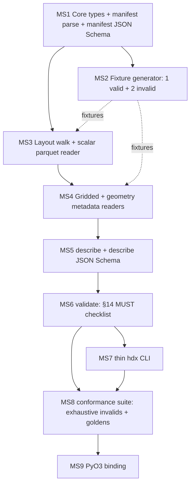

# HDX v0.1 — Milestone Plan

> **Source contract:** `spec/HDX_SPEC.md` (canonical, settled).
> **Planned against:** `architecture.md` (living build doc).
> **Scope (exactly):** `validate` + `describe` in `hdx-core`; a thin JSON-emitting
> `hdx` CLI over them; and (LAST) a PyO3 binding in `crates/python` (maturin).
> **Excluded forever:** `regrid` / `clip` / `reduce` or any reduction / hydrology
> operation. They MUST NOT enter `hdx-core`.

This plan decomposes HDX v0.1 into nine dependency-sequential milestones. Each is
vertically meaningful (delivers an inspectable outcome), independently reviewable,
and depends only on earlier milestones. Every milestone's exit criteria include
`cargo build` + `cargo test` + `cargo clippy -- -D warnings` passing, the specific
spec MUST-check IDs satisfied, and a commit following the repo's bump+tag
convention (`./scripts/bump-version.sh patch`, stage `Cargo.toml`, conventional
commit, `git tag v<version>`).

---

## Naming convention — milestone ids vs spec check ids (critique M4: id collision)

The spec §14 conformance checklist uses ids `M1`–`M6` (manifest), `L1`–`L3`,
`I1`–`I3`, `H1`–`H2`, `T1`–`T2`, `G1`–`G3`, `Geo1`. To avoid any collision, **this
plan names milestones `MS1`–`MS9`** (never `M1`…). Throughout, a bare `M1`/`G2`/`T2`
always means a **spec §14 check id**; "Milestone N" or `MSn` always means a plan
milestone. Where ambiguity could still arise, references are written explicitly as
"spec-check M5" vs "MS5".

---

## Ordering rationale

The architecture's central insight drives everything: **`validate` and `describe`
read metadata + small 1-D index reads, never gridded chunks** (architecture §1).
So the build is a layered discovery stack, assembled bottom-up, then exposed
through two verbs, a CLI, and a binding.

The ordering follows data-dependency, not feature glamour:

1. **Types first (MS1).** The whole codebase is "parse, don't validate" — invalid
   states must be unrepresentable. Nothing can be read into the domain until the
   domain types and the manifest parser exist. MS1 has zero external IO and is the
   floor everything stands on. The manifest JSON Schema (R4, manifest half) is
   pinned here because the manifest's shape is frozen by the spec (§11, exactly
   six fields) and never changes. The schema is validated **in a Rust test** via a
   `jsonschema` dev-dependency (critique MS1: name the mechanism).

2. **The fixture problem is confronted before any reader (MS2).** There is **no
   HDX writer in v0.1**, yet every reader milestone needs real parquet / Zarr /
   COG / geoparquet bytes to test against (risk **R2**). The architecture's
   8-milestone hint defers fixtures to milestone 7; that is too late — MS3/MS4
   readers would be untestable. So MS2 *resolves R2 first*: it stands up a
   dev-only, checked-in Python fixture generator with a regenerate script,
   producing **one minimal valid dataset plus two minimal invalid datasets**. The
   valid dataset is engineered so positive cross-basin paths (notably spec-check
   G2 cell-for-cell alignment via a *shared grid label*) are exercisable at the
   milestone that implements them. The two invalid datasets let MS6 demonstrate a
   `conformant:false` verdict in its own milestone (critique H-1, H-3). This is a
   deliberate, justified deviation from the hint.

3. **Readers, scalar before gridded (MS3 then MS4).** Scalar parquet (MS3) is the
   simplest reader (mature `arrow`/`parquet`), exercises the layout walk and the
   identity/time columns, and lets the discovery layer take shape. Gridded + the
   geometry reader (MS4) is where the hard crate-selection decision (**R1**) and
   the Zarr consolidated-metadata/sharding question (**§8**) land; doing it after
   the scalar half de-risks the discovery-layer design. MS3+MS4 together complete
   the discovery layer that both verbs share.

4. **`describe` before `validate` (MS5 then MS6).** `describe` only *reports* the
   discovery layer; `validate` *checks rules over it*. `describe` is the spec's
   declared stress test of the manifest floor (§10) — if it is hard, the floor is
   too thin, and we want to learn that before encoding the rule engine. `describe`
   still performs the **§0 hard version cut + manifest boundary-parse first**
   (critique MS5). MS5 pins the `describe` output JSON Schema (**R4**, describe
   half), validated in tests by the same `jsonschema` dev-dependency.

5. **`validate` (MS6).** With the discovery layer and `describe` proven, the §14
   MUST checklist becomes a rule pass over an already-typed model. MS6 makes the
   metadata-deep vs byte-deep depth decision (**R3**) explicit and reports skipped
   checks honestly. MS6 demonstrates **both** outcomes within its own milestone:
   `conformant:true` against the MS2 valid fixture (exercising positive paths,
   including spec-check G2 via the shared grid label) and `conformant:false`
   against MS2's two minimal invalid fixtures (critique H-3). MS6's per-check tests
   are split **honestly** (critique H-2): positive paths run against the MS2 valid
   fixture; negative/fail paths for cross-basin checks are seeded by MS2's two
   invalids now and **completed exhaustively in MS8** (one-violation-per-fixture),
   because differently-shaped on-disk datasets cannot be synthesized in-memory
   without a writer.

6. **The `hdx` CLI (MS7).** Thin glue: arg-parse → call `hdx-core` → serialize to
   JSON on stdout → exit code. A documented exit-code table (0 / 1 / 2) is a
   load-bearing deliverable for an LLM-drivable CLI (critique MS7).

7. **Conformance suite (MS8).** Resolves R2 fully: a curated family of invalid
   fixtures, each pinning exactly one violated check id (the exhaustive negative
   set MS6 deferred), plus golden `describe` outputs, all regenerated by the MS2
   generator and wired into regression tests.

8. **PyO3 binding (MS9).** Last. `crates/python` (maturin) mirrors — does not
   reimplement — `validate`/`describe` over the same `hdx-core` API.

**Why this deviates from the architecture §6 hint:** the hint's 8-step sequence
defers fixtures to step 7. We pull fixture generation forward to MS2 (R2 must be
solved before the first reader) and we make the **valid** fixture richer (shared
grid label, companion-mask + `{source}_{variable}` named fields, in-file vs folder
`basin_id` agreement, usable parquet `time` statistics) so that positive
conformance paths are testable at the milestone that builds them, and we pull
**two minimal invalids** forward so the validator is observed failing closed in
MS6. The exhaustive one-per-check invalid family stays in MS8. This is the only
material reordering; everything else follows the hint's spirit (discovery layer →
verbs → CLI → suite → PyO3).

---

## Dependency overview

`MS1 → MS2 → MS3 → MS4 → MS5 → MS6 → MS7 → MS8 → MS9.` MS2's dependency on MS1 is
**shape-only** (the frozen manifest/field JSON shapes from §11/§2), not a Rust
build/link dependency (critique MS2 ordering): the generator is Python and links
nothing from `hdx-core`, so it MAY proceed in parallel with MS1's Rust work once
the manifest shape is agreed. Every later Rust milestone reuses MS2's fixtures as
test inputs.

### Risk → milestone resolution map

| Risk | Where resolved |
|---|---|
| **R1** reader-crate selection (pure-Rust vs GDAL) | MS3 (parquet) decided; MS4 (Zarr/COG/geoparquet) decided + recorded as an architecture amendment |
| **R2** fixture generation (no writer) | MS2 (generator + 1 valid + 2 invalid) → MS8 (exhaustive one-per-check invalids + goldens) |
| **R3** metadata-deep vs byte-deep check depth | MS4 (what metadata is reachable), MS6 (per-check depth classification + honest skip reporting), incl. spec-check M6 cadence + §8 sharding/consolidated-metadata classification |
| **R4** output JSON-schema stability | MS1 (manifest schema), MS5 (describe schema); both validated in Rust tests via a `jsonschema` dev-dep |

---

## MS1 — Core types + manifest parse + manifest JSON Schema

**Goal.** Stand up the entire `hdx-core` type model under "parse, don't validate":
newtypes, the `FormatVersion` hard cut, the field 2×2 / `Quadrant`, a **closed**
`Dtype` with a fallible boundary parse, `Units`, and the six-field `Manifest`
parser that rejects any extra (derivable) field. Pin the manifest JSON Schema in
`schemas/`. Zero external IO — pure types and JSON parsing. This is the floor the
whole codebase stands on; it makes invalid states unrepresentable downstream.

**Deliverables.**
- `crates/core/src/types/` (or equivalent): newtypes `BasinId`, `FieldName`,
  `GridLabel`, `DelineationLabel`, `Crs`, `Cadence`, `DatasetName`,
  `ProducerVersion` — each opaque, constructed at the boundary.
- `FormatVersion` enum with `V0_1` only; `FromStr`/parse succeeds on `"0.1"` and
  **errors** (`UnknownFormatVersion`) on anything else (spec §0/§14 M2 hard cut).
- `Temporal { Static, Dynamic }`, `Shape { Scalar, Gridded }`, `Quadrant` (the
  four), `Field { name, quadrant, dtype, units, grid_label: Option<GridLabel> }`
  with the invariant `grid_label.is_some() ⇔ Shape::Gridded` enforced in the
  constructor (enums over booleans, spec §2).
- **`Dtype` as a CLOSED enum** with a documented physical-type → `Dtype` mapping
  and a **fallible** parse (`parse_dtype(&str) -> Result<Dtype, DtypeError>`) that
  **errors on unknown** physical types — no panic, no `unwrap`, no silent default
  (critique MS1 Dtype). Include an explicit `Unsupported`/`Other` policy: the
  decision is to *reject* unknown dtypes at the boundary with a typed error rather
  than carry an `Other(String)`, so library code states a **no-panic guarantee**
  for unknown dtypes. Documented in the type's doc comment.
- `Manifest` struct (exactly the six fields), with a `serde`-based parser that
  uses `deny_unknown_fields` so any extra key fails (spec §11 / §14 M3); validates
  `created_at` as RFC 3339, `crs`/`cadence` non-empty (§14 M4). `format_version`
  is read and hard-cut **first** (§0/§14 M1, M2).
- `thiserror` error enum skeleton with named-field variants, each doc-commented
  with *when* it fires: `UnknownFormatVersion`, `ExtraManifestField`,
  `MissingManifestField`, `InvalidTimestamp`, `EmptyCrs`, `EmptyCadence`,
  `UnknownDtype`, plus stubs for later (`BasinIdFolderMismatch`, `RaggedSchema`,
  `GridLabelMismatchAcrossBasins`, `MissingRootRollup`, `NonMonotonicTime`).
- `schemas/manifest.schema.json` — JSON Schema (`additionalProperties: false`,
  the six required fields, types) for `manifest.json`.
- A `jsonschema` **dev-dependency** and a test asserting the §11 manifest example
  validates against `manifest.schema.json`, and that a 7-field manifest fails
  both the Rust parser and the schema (critique MS1 validation mechanism).
- `crates/core/README.md` started: Mermaid module map + glossary (domain terms:
  field, quadrant, basin_id, grid label, delineation, cadence, manifest floor).

**Dependencies.** None.

**Reviewable outcome.** A reviewer runs `cargo test -p hdx-core` and sees: the §11
example manifest round-trips through the parser; a manifest with a 7th key is
rejected with `ExtraManifestField`; `FormatVersion::from_str("0.2")` returns
`UnknownFormatVersion`; an unknown dtype string returns `UnknownDtype` (never
panics); and the `jsonschema` test confirms the committed `manifest.schema.json`
accepts the §11 example and rejects the 7-field variant. No filesystem IO.

**Exit criteria.**
- `cargo build`, `cargo test`, `cargo clippy -- -D warnings` all pass.
- Spec MUST-checks satisfied (boundary-parse foundations): **M1** (manifest valid
  JSON, `format_version` first), **M2** (hard cut), **M3** (exactly six fields),
  **M4** (`created_at` RFC 3339; `crs`/`cadence` non-empty). Field-model
  scaffolding for **H1** (field schema: names/dtypes/quadrants) is typed but
  enforced later (MS6).
- `Dtype` is a closed enum with a no-panic fallible parse for unknowns
  (CLAUDE.md: no `unwrap`/`expect` in library code).
- `schemas/manifest.schema.json` committed and asserted in a Rust test via the
  `jsonschema` dev-dep.
- Commit via `./scripts/bump-version.sh patch` + stage `Cargo.toml` + conventional
  commit + `git tag v<version>`.

**Spec refs.** §0, §1 (inert/agnostic — no transform/role/semantic/provenance
fields exist on any type), §2 (field 2×2, quadrant per field), §11 (six-field
floor), §14 M1–M4 (foundations), §14 M3 (`deny_unknown_fields`).

**Risks.**
- *RFC 3339 parsing.* Use `time`/`chrono` with strict RFC 3339; pin the crate in
  MS1 to avoid churn. Reject offset-less timestamps if spec example is `Z`-form.
- *Over-modeling.* Resist adding any field beyond the six; resist a `role`/
  `transform`/`semantic` field anywhere (spec §1). The type model must contain
  nothing derivable or interpretive.
- *Dtype closure churn.* The closed enum may need a new arm when a real fixture
  surfaces an unmapped physical type; that is a typed-error-first situation, not a
  silent pass — record any addition as an architecture amendment.

---

## MS2 — Fixture generator: one valid + two minimal invalid datasets (resolves R2, part 1)

**Goal.** Resolve **R2** before any reader exists: there is no HDX writer in v0.1,
so a **dev-only, checked-in Python fixture generator** (NOT part of shipped
`hdx-core`) produces real on-disk HDX bytes for tests. MS2 produces (a) **one
minimal but mix-quadrant valid dataset**, engineered so that positive cross-basin
conformance paths — including spec-check **G2** (shared grid label ⇒ cell-for-cell
alignment) — are exercisable at the milestone that implements them, and (b) **two
minimal invalid datasets** (one wrong `format_version`, one missing root rollup) so
the validator can be observed returning `conformant:false` in MS6, its own
milestone (critique H-1, H-3).

**Deliverables.**
- `conformance/generator/` — a Python project (`pyproject.toml` or
  `requirements.txt`) using `pyarrow` (parquet/geoparquet), `xarray`+`zarr` (Zarr
  v3), `rioxarray`/`rasterio` (COG), `geopandas`/`shapely` (geometry). Pinned
  versions. A `Makefile`/`regenerate.sh` target rebuilds all fixtures
  deterministically.
- `conformance/valid/minimal/` — a valid dataset with **≥2 basins** and a field
  schema that **mixes all four quadrants** (one `scalar·static` attribute, one
  `scalar·dynamic` series, one `gridded·static` field, one `gridded·dynamic`
  field), proving a dataset MAY mix quadrants (§2). Specifically engineered so:
  - The COG (`gridded_static/<label>.tif`) and the Zarr
    (`gridded_dynamic/<label>.zarr`) **share one and the same grid label** in each
    basin, and the two artifacts are **cell-for-cell aligned** — this is the
    precondition that makes spec-check **G2's positive path** fire (critique H-1).
    A generator self-assertion verifies the shared label and alignment.
  - Per-basin **ragged time extents** (basins differ in period of record, §6.1),
    but **within each basin** `scalar_dynamic.parquet` and the `gridded_dynamic`
    Zarr share the **identical** time axis (§6.2). A generator self-assertion
    verifies the §6.1 ragged property across basins and §6.2 alignment within.
  - In-file `basin_id` **equals** the `basin=<id>` folder for every basin, and
    `basin_id` values are **unique** — generator self-asserts both (seeds spec
    checks I2, I3) (critique MS2 fixtures).
  - The scalar `time` column is a full timestamp, non-nullable, sorted ascending
    (§6 / spec-check T1), and the parquet is written with **row-group statistics
    on the `time` column** (§8) — generator self-asserts the written file carries
    usable min/max statistics for `time` so MS3's time-extent read can rely on
    them (critique MS3 / MS2 statistics).
  - The Zarr is written with **consolidated metadata** and **v3 sharding** per §8;
    the generator self-asserts consolidated metadata is present (so MS4 can gate on
    the §8 consolidated-metadata read path) (critique MS4 reader-crates).
  - At least one field is named with the **companion-mask** pattern
    (`{field}_was_filled`) and at least one with the **`{source}_{variable}`**
    pattern (e.g. `era5_precipitation`), so later milestones can assert these get
    **no special handling** and are catalogued as ordinary fields (spec §2;
    critique MS2 companion masks).
  - `outlines.geoparquet` with rows `(basin_id, delineation, geometry)`, ≥2
    `delineation` labels for at least one basin (§9 plurality), not partitioned by
    delineation.
- `conformance/invalid/wrong-format-version/` — identical to the valid dataset
  except `manifest.json` has `format_version: "0.2"` (pins spec-check **M2**).
- `conformance/invalid/missing-root-rollup/` — identical to the valid dataset
  except `scalar_static.parquet` (or `outlines.geoparquet`) is absent at the root
  (pins spec-check **L1**).
- `conformance/README.md` — documents the layout of each fixture, the regenerate
  command, the generator-is-dev-only rule, and a table mapping each invalid
  fixture to the one check id it violates.

**Dependencies.** **MS1 (shape only)** — the frozen manifest JSON shape (§11) and
field/quadrant model (§2) the generator must emit. **No `hdx-core` linkage**: the
generator is Python and compiles/links nothing from Rust, so MS2 MAY run in
parallel with MS1's Rust work once the manifest shape is agreed (critique MS2
ordering).

**Reviewable outcome.** A reviewer runs `conformance/generator/regenerate.sh` and
gets a byte-identical, inspectable tree under `conformance/valid/minimal/` plus the
two `conformance/invalid/*` trees. They can open `manifest.json`, dump the parquet
schema (`pyarrow`), inspect Zarr `.zmetadata`/consolidated metadata and the COG
band descriptions, and confirm: four quadrants present; COG+Zarr share a grid
label and are aligned; ragged-across / aligned-within time; `basin_id` matches
folder and is unique; `time` carries row-group statistics; companion-mask and
`{source}_{variable}` fields present; two invalids each differ from valid in
exactly one way. The generator's self-assertions all pass.

**Exit criteria.**
- Generator runs end-to-end and **self-asserts** every engineered property above
  (shared-grid-label alignment for G2; §6.1 ragged-extent + §6.2 intra-basin
  alignment; folder vs in-file `basin_id` equality + uniqueness; `time` row-group
  statistics present; Zarr consolidated metadata present; companion-mask &
  `{source}_{variable}` fields present). Self-assertion failures abort generation.
- One valid + two invalid datasets committed under `conformance/`; each invalid is
  documented as violating exactly one spec check (M2; L1).
- **Seeds (structurally; enforced later in MS3–MS6, not by MS2):** spec checks
  **L1, L2, L3, I1, I2, I3, H1, H2, T1, T2, G1, G2, G3, Geo1, M5, M6** all have
  on-disk preconditions present in the valid fixture. This is a *seeding* claim,
  not an enforcement claim — MS2 ships no Rust and enforces nothing (critique MS2
  relabeling).
- No Rust build change beyond possibly a `.gitignore`/path note; `cargo build` +
  `cargo test` + `cargo clippy -- -D warnings` still pass on the unchanged crate.
- Commit via the bump+tag convention.

**Spec refs.** §2 (mix-quadrant; companion-mask & `{source}_{variable}` are
ordinary fields), §3 (basin_id authoritative, folder agreement, uniqueness), §4
(layout), §5 (homogeneity), §6.1/§6.2 (ragged-across / aligned-within time, real
temporal type, `time` column), §7 (per-variable native grids, CF/GeoTIFF georef),
§8 (shared grid label ⇒ alignment; Zarr v3 sharding + consolidated metadata;
parquet row-group statistics), §9 (plural outlines), §10/R2 (no writer; dev-only
generator), §11 (six-field manifest).

**Risks.**
- *Crate/version drift in the Python stack.* Pin every dependency; the regenerate
  script must be reproducible. If `zarr-python`'s v3 sharding / consolidated
  metadata support is uncertain for the pinned version, record the exact versions
  used and surface the consolidated-metadata gate to MS4 (which decides whether the
  Rust reader reads via the §8 consolidated path or classifies it as a byte-deep
  R3 skip).
- *Over-rich fixture.* Keep "minimal" honest — exactly enough fields to cover the
  four quadrants + the two naming patterns; resist scope creep.
- *Generator masquerading as a writer.* The generator is a **test fixture tool**,
  not an HDX writer, and lives only in `conformance/` — never in `hdx-core` and
  never shipped. State this in `conformance/README.md`.

---

## MS3 — Layout discovery + scalar parquet reader (discovery layer, scalar half)

**Goal.** Build the first half of the shared **discovery layer**: walk the
basin-first hive tree, enumerate basins from `basin=<id>` directories, and read
parquet **metadata** (schema, `basin_id` column, `time` column type/sort/stats) for
`scalar_static.parquet` and each `scalar_dynamic.parquet`. Decide **R1** for
parquet (the mature pure-Rust `arrow`/`parquet` stack). Metadata + 1-D column reads
only — no gridded chunks (architecture §1).

**Deliverables.**
- `parquet`/`arrow` dependencies added to `crates/core/Cargo.toml`; **R1 decision
  for parquet recorded** (pure-Rust `arrow`/`parquet`, no GDAL).
- A layout-walk module: discovers the root rollups (`scalar_static.parquet`,
  `outlines.geoparquet`), enumerates `basin=<id>` directories, and produces a typed
  in-memory layout model (root artifacts + per-basin artifact paths). Distinguishes
  "absent gridded subtree because no gridded fields" from "missing required file"
  (foundations for spec checks L1/L2/L3; full enforcement in MS6).
- A scalar-parquet reader: extracts the arrow schema (→ `Vec<Field>` for scalar
  quadrants, dtypes mapped via MS1's closed `Dtype` parse), the `basin_id` column
  presence/value, and the `time` column (name, logical type, nullability, sort).
- **Per-basin time extent** read from parquet **row-group statistics** on the
  `time` column (§8 mandates these statistics), with a **bounded 1-D column-scan
  fallback** when statistics are absent — the fallback is classified explicitly
  under R3 as a metadata-vs-byte read and recorded in the reader's docs (critique
  MS3). A test asserts the MS2 valid fixture's `time` column carries usable
  statistics and that the extent comes from statistics (not the fallback) on that
  fixture.
- Typed errors for malformed parquet / missing required columns (named-field
  `thiserror` variants).
- Tests run against `conformance/valid/minimal/`: basins enumerated; scalar field
  schema discovered; `basin_id` present in `scalar_static` and each
  `scalar_dynamic`; `time` column identified with type/sort; companion-mask and
  `{source}_{variable}`-named scalar fields catalogued as **ordinary** fields with
  no special handling.

**Dependencies.** MS1 (types), MS2 (fixtures to read).

**Reviewable outcome.** `cargo test -p hdx-core` reads the real MS2 valid fixture
and surfaces: the basin list, the scalar field catalog (with quadrants and
dtypes), `basin_id` columns, the `time` column descriptor, and per-basin time
extents sourced from row-group statistics. A reviewer sees the scalar half of the
discovery layer populated from on-disk bytes, and confirms the companion-mask field
is treated as ordinary.

**Exit criteria.**
- `cargo build`, `cargo test`, `cargo clippy -- -D warnings` pass.
- R1 parquet decision recorded (architecture amendment).
- Time extent comes from parquet row-group statistics with a documented,
  R3-classified bounded-scan fallback; a test confirms the MS2 fixture uses
  statistics.
- Spec MUST-checks advanced (discovery foundations; enforced in MS6): **L1/L2/L3**
  (layout model), **I1** (basin_id column present), **T1** (time column
  type/sort/non-null discovered). Companion-mask handling validated as ordinary
  (spec §2).
- Commit via the bump+tag convention.

**Spec refs.** §2 (ordinary fields, companion masks), §3 (basin_id column), §4
(basin-first hive layout), §6 (`time` column type/sort), §8 (row-group statistics),
§14 L1–L3, I1, T1; architecture §1 (metadata reads), R1, R3.

**Risks.**
- *Parquet statistics absent.* Some writers omit min/max for timestamp logical
  types; MS2's generator self-asserts they are present, and MS3 has the
  R3-classified scan fallback. If pyarrow cannot be coerced to write `time`
  statistics, record it and rely on the fallback, classified honestly.
- *geoparquet deferred.* `outlines.geoparquet` parsing is MS4; MS3 only confirms
  the file's *presence* as a root rollup, not its schema.

---

## MS4 — Gridded + geometry metadata readers (discovery layer, gridded/geometry half)

**Goal.** Complete the shared discovery layer: read Zarr v3 metadata/attrs +
`time`/`lat`/`lon` coordinate arrays and CF georeferencing; read COG band
descriptions + standard georef tags; read `outlines.geoparquet` schema +
`delineation`/`basin_id` columns. Land the hard **R1** crate decision for Zarr /
COG / geometry, and explicitly resolve the **§8 consolidated-metadata / sharding**
read question (critique MS4). Metadata + 1-D coordinate reads only — never gridded
chunks (architecture §1).

**Deliverables.**
- R1 decision for gridded + geometry recorded as an architecture amendment.
  *Recommended default:* pure-Rust stack — `zarrs` (Zarr v3, sharding,
  consolidated metadata), `tiff` + GeoKey parsing for COG, `geoarrow`/`wkb` +
  `geo-types` (or `parquet` schema read) for geoparquet — falling back to `gdal`
  only if a required metadata read (e.g. COG band descriptions) is otherwise
  unreachable. The decision and any fallback are recorded.
- Zarr reader: per-grid-label metadata (array names = CF variables = field names →
  `gridded·dynamic` fields), `time`/`lat`/`lon` coordinate arrays (1-D), CF
  `grid_mapping`/CRS, units from CF `units` attr, extent/affine/resolution per
  field. **§8 consolidated-metadata gate (critique MS4):** the reader MUST read the
  MS2 fixture's metadata via the §8 **consolidated-metadata** path (one GET to
  learn the store) **OR** consolidated-metadata/sharding verification is explicitly
  classified as a **byte-deep R3 skipped check with a stated reason**. MS4 ties to
  MS2's consolidated-metadata self-check; the chosen outcome is documented so a
  reviewer knows which path is live.
- COG reader: band descriptions (= field names → `gridded·static` fields), standard
  georef tags, per-field extent/affine/resolution, units from band metadata.
- Geoparquet reader: schema check for rows `(basin_id, delineation, geometry)`, the
  `delineation` label column, the `basin_id` column, and a "not partitioned by
  delineation" structural read (single file at root).
- The reader output feeds the unified discovery model (`GridInfo` per grid label,
  delineation labels, gridded field catalog) shared with the scalar half from MS3.
- Tests against `conformance/valid/minimal/`: Zarr variables discovered with CF
  lat/lon + grid_mapping; COG bands discovered with georef; the shared grid label
  observed identical across the `gridded_static` (COG) and `gridded_dynamic` (Zarr)
  subtrees (the on-disk precondition for spec-check G2, read but not yet enforced);
  geoparquet `(basin_id, delineation, geometry)` schema and `delineation` labels
  discovered; the `{source}_{variable}`-named gridded field catalogued as ordinary.

**Dependencies.** MS3 (scalar half of the discovery layer + layout model).

**Reviewable outcome.** `cargo test -p hdx-core` reads the real MS2 fixture and
surfaces the gridded + geometry half: per-grid `GridInfo` (extent/affine/res/CRS),
the gridded field catalog, the CF georef presence, the COG band descriptions, the
shared-grid-label observation across subtrees, and the discovered `delineation`
labels. A reviewer confirms the discovery layer is now complete and sees explicitly
whether Zarr metadata was read via the §8 consolidated-metadata path or classified
as an R3 byte-deep skip.

**Exit criteria.**
- `cargo build`, `cargo test`, `cargo clippy -- -D warnings` pass.
- R1 decision (Zarr/COG/geometry) recorded as an architecture amendment.
- **§8 consolidated-metadata read is either live (reads the MS2 fixture's metadata
  via the consolidated path) or recorded as a byte-deep R3 skipped check with a
  reason** (critique MS4). The same gate applies to v3 sharding verification.
- Discovery layer complete: both verbs (MS5/MS6) can now assemble from one typed
  in-memory model.
- Spec MUST-checks advanced (discovery foundations; enforced in MS6): **G1**
  (self-naming variables/bands; no positional channel axis), **G3** (CF / GeoTIFF
  georef present), **G2** precondition (shared label observed across subtrees),
  **Geo1** (outlines schema + `delineation` column), **I1** (basin_id in outlines).
- Commit via the bump+tag convention.

**Spec refs.** §7 (per-variable native grids, CF/GeoTIFF georef, one dataset-wide
CRS), §8 (one artifact = one grid; self-naming; shared grid label ⇒ alignment; Zarr
v3 sharding + consolidated metadata), §9 (plural outlines, `delineation` column,
not partitioned), §14 G1–G3, Geo1, I1; architecture §1, R1, R3.

**Risks.**
- *Crate maturity (R1).* `zarrs` consolidated-metadata / sharding behavior and
  pure-Rust COG band-description reads are the highest-uncertainty items. If a
  required metadata read is unreachable in pure Rust, the recorded fallback is
  `gdal` for that read only; if consolidated metadata is unreachable, classify it
  as an R3 byte-deep skip with a reason (do not silently claim §8 compliance).
- *CRS representation.* Normalize CRS strings (e.g. `EPSG:4326`) consistently
  between manifest, Zarr `grid_mapping`, COG tags, and geoparquet for the spec-check
  M5 cross-check that lands in MS6 — defer the actual cross-check **rule** to MS6
  (the validator), MS4 only *reads* the CRS from each file.
- *geoparquet flavor drift.* geoparquet metadata conventions vary; read the schema
  + columns structurally and avoid depending on optional geo-metadata blocks.

---

## MS5 — `describe`: assemble + emit the full self-description (+ describe JSON Schema)

**Goal.** Implement `describe` (spec §10): from the completed discovery layer,
assemble the `Description` (manifest, basins, homogeneous field catalog with the
2×2 quadrant per field, per-grid info, per-basin ragged time extents, units,
delineation labels) and serialize it to stable JSON. `describe` **reports facts
only — no conformance verdict** — but it still performs the **§0 hard version cut
and manifest boundary-parse first**, before any discovery (critique MS5). Pin the
`describe` output JSON Schema in `schemas/` (R4). This is the spec's declared stress
test of the manifest floor.

**Deliverables.**
- `describe(path) -> Result<Description, DescribeError>` in `hdx-core`:
  - **First**: read `manifest.json`, hard-cut on `format_version` (reject unknown
    with `UnknownFormatVersion`), and boundary-parse the six-field manifest —
    **before** touching any other file (spec §0). Discovery only proceeds for a
    known version with a parseable manifest (critique MS5).
  - Then: assemble `Description` from the MS3+MS4 discovery layer — `basins`,
    homogeneous `fields` (one-basin read per §5, with quadrant per field),
    `grids` (per grid label), `time_extent` (per-basin ragged, §6.1),
    `delineations`. Reports discovery **gaps as facts**, not verdicts.
- `serde`-based JSON serialization; the JSON shape is the R4 mini-contract.
- `schemas/describe.schema.json` — JSON Schema for the `Description` output.
- A `jsonschema`-dev-dep test asserting the golden `describe` output of the MS2
  valid fixture validates against `describe.schema.json` (critique MS5/MS1
  validation mechanism).
- A **golden `describe` output** for `conformance/valid/minimal/`, checked into
  `conformance/` and asserted in a snapshot test.
- A test that `describe` over `conformance/invalid/wrong-format-version/` (which has
  `format_version: "0.2"`) **errors with `UnknownFormatVersion`** before any
  discovery — proving the §0 hard cut applies to `describe` too (critique MS5).
- The companion-mask and `{source}_{variable}` fields appear in the catalog as
  **ordinary fields** (no special handling) — asserted in the golden snapshot.

**Dependencies.** MS4 (complete discovery layer).

**Reviewable outcome.** A reviewer runs the (MS7) verb path or a test harness over
`conformance/valid/minimal/` and inspects the emitted `Description` JSON: every
field with its quadrant, per-grid extent/res/CRS, per-basin time ranges, units,
delineation labels, basin list — all *discovered*, none *declared* beyond the six
manifest fields. They confirm `describe` over the wrong-version fixture errors with
`UnknownFormatVersion` (hard cut applied first), and that the golden output
validates against `describe.schema.json`.

**Exit criteria.**
- `cargo build`, `cargo test`, `cargo clippy -- -D warnings` pass.
- `describe` performs the **§0 hard version cut + manifest boundary-parse first**;
  a test confirms it errors with `UnknownFormatVersion` on `format_version: "0.2"`
  before discovery (critique MS5).
- `describe` emits no conformance verdict (facts only); the floor is exercised
  (stress test §10) — if `describe` needed a value not in the six manifest fields
  and not discoverable, that is a floor bug to flag, not a manifest addition.
- `schemas/describe.schema.json` committed; golden output committed; both asserted
  in Rust tests via the `jsonschema` dev-dep.
- Spec MUST-checks supported (discovery surface for the validator): the full §14
  fact set is now *discoverable*; **M1/M2** hard-cut behavior enforced in
  `describe`'s entry path.
- Commit via the bump+tag convention.

**Spec refs.** §0 (hard cut first), §2 (quadrant per field; ordinary fields), §5
(one-basin discovery), §6.1 (ragged time extents), §7 (per-grid info), §9
(delineation labels), §10 (`describe` is the floor's stress test, facts only), §11
(six-field floor — nothing derivable declared); R4; architecture §5.

**Risks.**
- *Floor-too-thin discovery.* If assembling `Description` reveals a needed fact
  that is neither in the six manifest fields nor discoverable from files, the
  correct response is to flag a spec issue — **never** add a manifest field
  (§11). Record any such finding as an architecture amendment.
- *Output-schema churn.* Lock the `Description` JSON shape now (R4); later
  milestones (CLI, PyO3) depend on its stability. Version it implicitly by
  `format_version` only.

---

## MS6 — `validate`: the §14 MUST checklist over the discovery layer

**Goal.** Implement `validate` (spec §10): run the complete §14 `MUST` checklist
(M1–M6, L1–L3, I1–I3, H1–H2, T1–T2, G1–G3, Geo1) over the shared discovery layer,
producing a `ValidationReport` of per-check outcomes (ran / skipped, pass / fail,
detail) and an overall `conformant: bool`. **Fails closed** on any violated MUST.
Make the **R3** metadata-deep vs byte-deep depth decision explicit per check and
report skipped checks honestly. Demonstrate **both** verdicts within this milestone:
`conformant:true` on the MS2 valid fixture and `conformant:false` on MS2's two
invalids (critique H-3).

**Deliverables.**
- `validate(path) -> Result<ValidationReport, ValidateError>` in `hdx-core`. Like
  `describe`, it performs the **§0 hard version cut + manifest boundary-parse
  first**; spec-checks M1 (manifest valid JSON / `format_version` first) and M2
  (hard cut) are the entry gate.
- The full §14 rule set over the discovery layer:
  - **Manifest M1–M6.** M5 (`crs` matches the CRS carried in every georeferenced
    file) cross-checks the manifest CRS against the per-file CRS read in MS4.
    **spec-check M6 (cadence consistent with realized `time` axes) — defined and
    R3-classified (critique MS6 cadence):** because HDX **parses no cadence
    semantics** (cadence is an opaque string, §1/§6.4), MS6 implements a concrete
    **non-semantic** rule: `cadence` is a non-empty string (already M4) **and** the
    realized per-basin `time` axes are **uniformly spaced** (constant step within
    each basin) and **consistent across basins** (same step). It does **not**
    interpret the string `"daily"` as 1-day spacing (that would be semantic
    interpretation HDX must avoid). The documented limit: HDX verifies *axis
    regularity*, not that the spacing *matches the cadence word*. If even
    axis-regularity cannot be determined cheaply for a fixture, spec-check M6 is
    reported **skipped with a stated reason** under R3 rather than silently passing.
    The no-cadence-semantics tension is documented in the check's doc comment.
  - **Layout L1–L3.** Rollups at root (L1); `basin=<id>` shape + required
    per-basin artifacts derived from the field set, gridded subtrees present iff
    gridded fields declared (L2); no stray/ragged files, absence = NaN not missing
    file (L3).
  - **Identity I1–I3.** `basin_id` present in `scalar_static`, every
    `scalar_dynamic`, and `outlines` (I1); in-file `basin_id` agrees with the
    `basin=<id>` folder (I2); `basin_id` unique within the dataset (I3).
  - **Homogeneity H1–H2.** Identical field schema (names, dtypes, quadrants) across
    all basins (H1); identical grid-label set across basins (H2).
  - **Time T1–T2.** `time` column named `time`, full timestamp, non-nullable,
    sorted ascending (T1); within each basin `scalar_dynamic` and all
    `gridded_dynamic` artifacts share the identical time axis, gaps NaN-filled
    (T2).
  - **Grids G1–G3.** One artifact = one grid; self-naming (CF variable / COG band
    = field name); no positional channel axis (G1). **spec-check G2:** each
    artifact named after its grid label, **and a shared label across the
    static/dynamic subtrees implies (and MUST exhibit) cell-for-cell alignment** —
    its **positive path is exercised on the MS2 valid fixture** (which by MS2's
    design shares one aligned grid label across COG and Zarr) (critique H-1). CF /
    GeoTIFF georef present (G3).
  - **Geometry Geo1.** `outlines.geoparquet` schema `(basin_id, delineation,
    geometry)`, label column `delineation`, not partitioned by delineation.
- Every check records **ran vs skipped** and the **R3 depth classification**
  (metadata-deep vs byte-deep). Byte-deep items not yet implemented (e.g. exact
  sharding/overview byte verification, possibly consolidated-metadata if MS4
  classified it as a skip) are reported `skipped` with a reason — the validator
  MUST clearly report which checks ran (spec §14 note).
- Companion-mask (`{field}_was_filled`) and `{source}_{variable}` fields are
  validated as **ordinary** fields — an assertion confirms no suffix/prefix special
  casing (spec §2; critique MS2 companion masks).
- `ValidationReport` JSON serialization (per-check outcomes + `conformant`).
- **Testing, split honestly (critique H-2):**
  - **Positive paths** for all checks (including cross-basin H1/H2/I2/I3/T2/G2) are
    exercised against `conformance/valid/minimal/`, which yields `conformant:true`.
  - **Negative/fail paths** are demonstrated *in this milestone* against MS2's two
    minimal invalids: `conformance/invalid/wrong-format-version/` → fails M2 →
    `conformant:false`; `conformance/invalid/missing-root-rollup/` → fails L1 →
    `conformant:false`. This proves the validator fails closed within its own
    milestone (critique H-3).
  - The **exhaustive one-violation-per-check** negative family for the remaining
    cross-basin and per-file checks is **explicitly deferred to MS8**, because
    those differently-shaped on-disk datasets cannot be synthesized in-memory
    without a writer (the same R2 rationale that justifies MS2/MS8). MS6 makes **no
    claim** of per-check inline negative unit tests for cross-basin checks (critique
    H-2). Where a negative case *can* be built purely in-memory over the typed
    discovery model (e.g. a hand-constructed `Vec<Field>` with a dtype mismatch for
    the H1 rule function), a unit test does so; this is stated per check rather than
    asserted globally.

**Dependencies.** MS5 (`describe` + the proven discovery layer; shared assembly).

**Reviewable outcome.** A reviewer runs the validator (via test harness or, after
MS7, the CLI) over `conformance/valid/minimal/` and sees `conformant: true` with
every applicable check `ran: pass` (or honestly `skipped` with a reason), and over
the two MS2 invalids sees `conformant: false` with exactly the violated check
flagged (M2; L1). They can read the per-check R3 depth classification and the
spec-check M6 cadence rule + its documented limit, and confirm spec-check G2's
positive path fired on the shared-label fixture.

**Exit criteria.**
- `cargo build`, `cargo test`, `cargo clippy -- -D warnings` pass.
- All §14 checks implemented or **honestly reported `skipped` with a reason** under
  R3; the report states which ran.
- **All §14 MUST-checks satisfied (this is the milestone that enforces the full
  list):** M1–M6, L1–L3, I1–I3, H1–H2, T1–T2, G1–G3, Geo1.
- spec-check M6 (cadence) has a **defined non-semantic rule** (axis regularity +
  cross-basin consistency) or is reported skipped with a reason — never silently
  passing (critique MS6).
- The MS2 valid fixture validates `conformant: true` **and** spec-check G2's
  positive path is exercised on it (shared aligned grid label) (critique H-1);
  both MS2 invalids validate `conformant: false`, each pinning its one check
  (critique H-3).
- MS6 makes no claim of per-check inline negative tests for cross-basin checks;
  the exhaustive negative family is deferred to MS8 (critique H-2).
- Commit via the bump+tag convention.

**Spec refs.** §0 (hard cut first), §1 (inert/agnostic — no semantic interpretation
of cadence), §2–§9 (all the structural rules), §10 (validate = spec executed), §11
(manifest floor), §14 (every check id), §14 note (report which checks ran); R3.

**Risks.**
- *spec-check M6 vacuity vs semantic drift.* The chosen rule (axis regularity, no
  word-interpretation) walks the narrow line: it must not become vacuous (silently
  passing) nor interpret cadence words. The R3 skip-with-reason path is the safety
  valve. Documented explicitly.
- *Cross-basin negative coverage.* MS6 cannot fully demonstrate every check's fail
  path with only two invalids; this is by design — the exhaustive set is MS8.
  Reviewers should accept MS6 as "fails closed, two checks demonstrated; full
  negative matrix in MS8".
- *Byte-deep honesty.* The temptation to claim a byte-deep check passed when only
  metadata was read; enforce the ran/skipped + R3-classification discipline.

---

## MS7 — The thin `hdx` CLI

**Goal.** Wrap the two verbs in a thin, JSON-emitting, LLM-drivable CLI
(`hdx validate <path>`, `hdx describe <path>`) — spec §10. **No contract logic in
`main.rs`**: arg-parse → call `hdx-core` → serialize the result to JSON on stdout →
exit code. `tracing` diagnostics to stderr; JSON is *output*, not logging. A
documented exit-code table is a deliverable (critique MS7).

**Deliverables.**
- `src/main.rs` (root `hdx` bin) gains subcommands `validate` and `describe` (e.g.
  via `clap`), each taking a dataset path.
- `hdx describe <path>` prints the `Description` JSON (MS5 schema) to stdout.
- `hdx validate <path>` prints the `ValidationReport` JSON (MS6) to stdout.
- **Exit-code table (promoted into deliverables + exit criteria, critique MS7):**

  | Code | Meaning |
  |---|---|
  | `0` | success — `describe` succeeded, or `validate` returned `conformant: true` |
  | `1` | non-conformant — `validate` returned `conformant: false` |
  | `2` | usage / IO error — bad args, unreadable path, unknown `format_version` (hard cut), malformed manifest |

- `anyhow` with `.context()` in the glue (application code); `tracing` to stderr.
- CLI tests asserting **each exit code**: `describe`/`validate` on the MS2 valid
  fixture → `0`; `validate` on an MS2 invalid (missing root rollup) →
  `1`; a non-existent path or the wrong-`format_version` fixture → `2` (critique
  MS7). Tests assert stdout is valid JSON matching the relevant schema.

**Dependencies.** MS6 (both verbs implemented).

**Reviewable outcome.** A reviewer runs `hdx describe conformance/valid/minimal`
and `hdx validate conformance/valid/minimal` and sees well-formed JSON on stdout
with exit `0`; runs `hdx validate conformance/invalid/missing-root-rollup` and sees
`conformant:false` JSON with exit `1`; runs `hdx validate /nonexistent` and sees a
diagnostic on stderr with exit `2`. JSON validates against the committed schemas.

**Exit criteria.**
- `cargo build`, `cargo test`, `cargo clippy -- -D warnings` pass.
- The exit-code table is implemented and **each code is asserted by a CLI test**
  (0 success/conformant, 1 non-conformant, 2 usage/IO error) (critique MS7).
- No contract logic in `main.rs` (verified by review — only arg-parse, call,
  serialize, exit).
- JSON on stdout; `tracing` diagnostics on stderr (never `println!` for
  diagnostics).
- Spec MUST-checks: none new (CLI is glue) — it exposes the MS6 enforcement of all
  §14 checks through a stable interface.
- Commit via the bump+tag convention.

**Spec refs.** §10 (thin JSON-emitting LLM-drivable CLI wrapping the verbs);
architecture §2 (thin glue, JSON to stdout, tracing to stderr); R4 (stable JSON).

**Risks.**
- *Logic leaking into the CLI.* Keep `main.rs` glue-only; any rule belongs in
  `hdx-core`. Review gate.
- *Exit-code conflation.* Distinguishing `1` (non-conformant) from `2` (error) is
  load-bearing for scripting; the test matrix enforces it.

---

## MS8 — Conformance suite: exhaustive invalids + golden outputs (resolves R2, part 2)

**Goal.** Complete **R2**: build the curated conformance suite — the **exhaustive
family of invalid fixtures, each pinning exactly one violated §14 check id** (the
negative matrix MS6 deferred), plus golden `describe` outputs — all regenerated by
the MS2 generator and wired into regression tests. This is the validator's full
fail-closed proof across the §14 checklist.

**Deliverables.**
- Extend `conformance/generator/` to emit **one invalid dataset per applicable §14
  check**, each differing from the valid baseline in exactly one way that violates
  exactly one check. Coverage (each maps to one check id):
  - **M2** wrong `format_version` (reuse MS2's), **M3** extra/derivable manifest
    field, **M4** malformed `created_at` / empty `crs` / empty `cadence`, **M5**
    `crs` mismatch between manifest and a file, **M6** irregular/inconsistent `time`
    axis (or documented skip),
  - **L1** missing root rollup (reuse MS2's), **L2** missing required per-basin
    artifact / gridded subtree present without gridded fields, **L3** a stray /
    ragged file,
  - **I1** missing `basin_id` column, **I2** in-file `basin_id` disagrees with
    folder, **I3** duplicate `basin_id`,
  - **H1** one basin with a divergent field schema, **H2** one basin with a
    divergent grid-label set,
  - **T1** non-monotonic / nullable / mis-typed `time`, **T2** intra-basin time
    axis mismatch between `scalar_dynamic` and `gridded_dynamic`,
  - **G1** positional channel axis / unnamed band, **G2** shared grid label across
    subtrees that is **not** cell-for-cell aligned (the negative of MS6's positive
    path), **G3** missing CF / GeoTIFF georef,
  - **Geo1** outlines missing a required column / partitioned by delineation.
- A regression test that runs `validate` over each invalid fixture and asserts
  `conformant: false` **with exactly the expected check id failing** and all others
  passing or honestly skipped.
- Golden `describe` outputs for the valid fixture(s) (extending MS5's golden),
  asserted by snapshot tests; a documented golden-update workflow.
- An assertion that the **companion-mask** and **`{source}_{variable}`** fields are
  catalogued as ordinary fields with **no special handling** in both `describe`
  and `validate` (spec §2; critique MS2 companion masks).
- `conformance/README.md` updated: the full check-id → invalid-fixture table, the
  regenerate workflow, the golden-update workflow, and the dev-only-generator rule.

**Dependencies.** MS6 (validator to assert against), MS7 (CLI exit-code path may be
used in some regression tests).

**Reviewable outcome.** A reviewer runs the conformance regression test and sees:
every invalid fixture yields `conformant: false` with exactly its one pinned check
failing; the valid fixture yields `conformant: true`; golden `describe` outputs
match. They can read the check-id → fixture table in `conformance/README.md` and
regenerate the whole suite deterministically.

**Exit criteria.**
- `cargo build`, `cargo test`, `cargo clippy -- -D warnings` pass.
- One invalid fixture per applicable §14 check, each pinning exactly one violated
  check id; all wired into regression tests (the negative matrix MS6 deferred).
- Golden `describe` outputs committed and asserted.
- R2 fully resolved: the generator regenerates valid + all invalid fixtures
  deterministically; documented as dev-only, never shipped in `hdx-core`.
- Spec MUST-checks: **every §14 check** now has both a positive (valid fixture) and
  a negative (one-violation invalid) regression test — the complete fail-closed
  proof.
- Commit via the bump+tag convention.

**Spec refs.** §14 (every check id, positive + negative), §10/R2 (no writer;
dev-only generator), §2 (companion masks ordinary); architecture §6 (conformance
suite), R2, R3 (skipped checks reported honestly in the report).

**Risks.**
- *Fixture explosion / maintenance.* ~18 invalid trees plus the valid baseline;
  keep each minimal (one mutation off the baseline) and generate them
  programmatically from the baseline so maintenance is one generator, not 18 hand
  trees.
- *One-violation purity.* A mutation may accidentally trip a second check; the
  regression test asserting "exactly this id fails, others pass/skip" catches
  cross-contamination — tune each mutation to be surgical.
- *spec-check M6 negative.* If M6 is implemented as skip-with-reason in MS6, its
  invalid fixture's expected outcome is "M6 skipped, dataset still conformant" —
  document that explicitly so the regression test asserts the right thing.

---

## MS9 — PyO3 binding (`crates/python`, maturin)

**Goal.** Last milestone. Expose `validate`/`describe` to Python via a PyO3 binding
in `crates/python`, built with maturin — **mirroring, not reimplementing**, the
`hdx-core` verbs. No contract logic in the binding; it calls `hdx-core` and returns
the same JSON-shaped results.

**Deliverables.**
- `crates/python/` PyO3 crate (added to the workspace members) with maturin
  packaging (`pyproject.toml`).
- Two Python-callable functions, e.g. `hdx.validate(path) -> dict` and
  `hdx.describe(path) -> dict`, each a thin wrapper over the corresponding
  `hdx-core` function, returning the same structures (MS5/MS6 JSON schemas) as
  Python objects (or JSON strings parsed to dict).
- Error mapping: `hdx-core` errors → Python exceptions (including the §0 hard cut →
  a clear `UnknownFormatVersion`-style exception); no silent fallback.
- Python-side tests: `describe`/`validate` over `conformance/valid/minimal/` return
  the expected structure; `validate` over an MS2 invalid returns `conformant:false`;
  `describe`/`validate` over the wrong-`format_version` fixture raises the hard-cut
  exception (mirroring §0).
- Docs: a short `crates/python/README.md` showing build (maturin) + usage, stating
  the binding mirrors `hdx-core` and adds no contract logic.

**Dependencies.** MS8 (the full verb behavior + conformance suite proven), which
itself depends on MS6/MS7.

**Reviewable outcome.** A reviewer builds the wheel (`maturin develop` /
`maturin build`), imports `hdx` in Python, and runs `hdx.describe` /
`hdx.validate` over the conformance fixtures, getting structures matching the Rust
JSON schemas and the same conformance verdicts; the wrong-version fixture raises a
hard-cut exception. The binding's source shows it only calls `hdx-core`.

**Exit criteria.**
- `cargo build`, `cargo test`, `cargo clippy -- -D warnings` pass for the
  workspace (incl. `crates/python`); maturin build succeeds; Python tests pass.
- The binding mirrors — does not reimplement — `validate`/`describe`; no §14 rule
  logic lives in `crates/python` (review gate).
- The §0 hard cut is preserved through the binding (wrong version → exception).
- Spec MUST-checks: none new; the binding exposes the MS6 enforcement of all §14
  checks to Python with identical verdicts.
- Commit via the bump+tag convention.

**Spec refs.** §10 ("PyO3 mirrors them"); architecture §2 (`crates/python` mirrors
over the same `hdx-core` API); §0 (hard cut preserved); R4 (same stable JSON shape).

**Risks.**
- *Reimplementation drift.* The binding must call `hdx-core`, never re-encode
  rules; enforce by review and by reusing the exact same conformance fixtures for
  the Python tests so any drift surfaces immediately.
- *Build toolchain.* maturin / PyO3 / Python ABI version pinning; keep the binding
  minimal to reduce surface.

---

## Coverage check — every §14 MUST check is assigned

| Spec check | Discovered/seeded | Enforced | Positive test | Negative test |
|---|---|---|---|---|
| M1 manifest JSON / version-first | MS1 | MS6 (entry gate) | MS6 (valid) | MS8 (malformed manifest) |
| M2 hard cut `0.1` | MS1 | MS5/MS6 (entry) | MS6 (valid) | **MS6** (MS2 wrong-version) + MS8 |
| M3 exactly six fields | MS1 | MS6 | MS6 (valid) | MS8 (extra field) |
| M4 created_at RFC3339; crs/cadence non-empty | MS1 | MS6 | MS6 (valid) | MS8 |
| M5 crs matches files | MS4 (read) | MS6 (cross-check) | MS6 (valid) | MS8 (crs mismatch) |
| M6 cadence vs realized time axes | MS3/MS4 | MS6 (non-semantic rule or R3 skip) | MS6 (valid) | MS8 (irregular axis / skip-documented) |
| L1 root rollups exist | MS3 | MS6 | MS6 (valid) | **MS6** (MS2 missing-rollup) + MS8 |
| L2 basin dirs + derived artifacts | MS3 | MS6 | MS6 (valid) | MS8 |
| L3 no stray/ragged files | MS3 | MS6 | MS6 (valid) | MS8 |
| I1 basin_id column present | MS3/MS4 | MS6 | MS6 (valid) | MS8 |
| I2 in-file basin_id == folder | MS2 (self-check) / MS3 | MS6 | MS6 (valid) | MS8 |
| I3 basin_id unique | MS2 (self-check) / MS3 | MS6 | MS6 (valid) | MS8 |
| H1 identical field schema | MS3/MS4 | MS6 | MS6 (valid) | MS8 |
| H2 identical grid-label set | MS4 | MS6 | MS6 (valid) | MS8 |
| T1 time column type/sort/non-null | MS3 | MS6 | MS6 (valid) | MS8 |
| T2 intra-basin time alignment | MS3/MS4 | MS6 | MS6 (valid) | MS8 |
| G1 self-naming, no channel axis | MS4 | MS6 | MS6 (valid) | MS8 |
| G2 shared label ⇒ alignment | MS2 (shared label) / MS4 | MS6 | **MS6** (valid, shared aligned label) | MS8 (shared-but-misaligned) |
| G3 CF / GeoTIFF georef | MS4 | MS6 | MS6 (valid) | MS8 |
| Geo1 outlines schema/label | MS4 | MS6 | MS6 (valid) | MS8 |

Every check is discovered by MS1–MS4, enforced by MS6, and has a positive test
(MS6 valid fixture) and a negative test (MS6 for the two pulled-forward invalids;
MS8 for the exhaustive one-per-check family).
