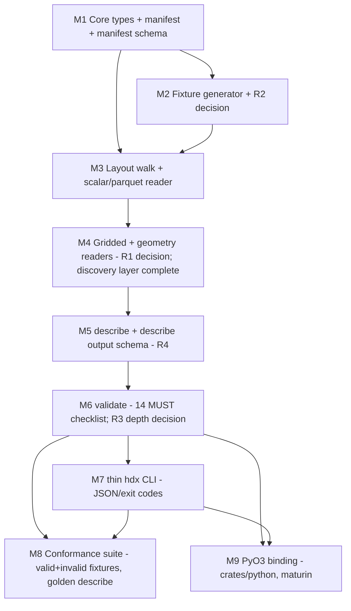

# HDX v0.1 — Milestone Plan

> **Source contract:** `spec/HDX_SPEC.md` (canonical, settled).
> **Planned against:** `architecture.md` (living build doc).
> **Scope (exactly):** `validate` + `describe` in `hdx-core`; a thin JSON-emitting
> `hdx` CLI over them; and (LAST) a PyO3 binding in `crates/python` (maturin).
> **Excluded forever:** `regrid` / `clip` / `reduce` or any reduction / hydrology
> operation. They MUST NOT enter `hdx-core`.

This plan decomposes HDX v0.1 into nine dependency-sequential milestones. Each is
vertically meaningful (delivers an inspectable outcome), independently reviewable,
and depends only on earlier milestones. Every milestone's exit criteria include
`cargo build` + `cargo test` + `cargo clippy -- -D warnings` passing, the specific
spec MUST-check IDs satisfied, and a commit following the repo's bump+tag
convention (`./scripts/bump-version.sh patch`, stage `Cargo.toml`, conventional
commit, `git tag v<version>`).

---

## Ordering rationale

The architecture's central insight drives everything: **`validate` and `describe`
read metadata + small 1-D index reads, never gridded chunks** (architecture §1).
So the build is a layered discovery stack, assembled bottom-up, then exposed
through two verbs, a CLI, and a binding.

The ordering follows data-dependency, not feature glamour:

1. **Types first (M1).** The whole codebase is "parse, don't validate" — invalid
   states must be unrepresentable. Nothing can be read into the domain until the
   domain types and the manifest parser exist. M1 has zero external IO and is the
   floor everything stands on. The manifest JSON Schema (R4, manifest half) is
   pinned here because the manifest's shape is frozen by the spec (§11, exactly
   six fields) and never changes.

2. **The fixture problem is confronted before any reader (M2).** There is **no
   HDX writer in v0.1**, yet every reader milestone needs real parquet / Zarr /
   COG / geoparquet bytes to test against (risk **R2**). The architecture's
   8-milestone hint defers fixtures to milestone 7; that is too late — M3/M4
   readers would be untestable. So M2 *resolves R2 first*: it stands up a
   dev-only, checked-in fixture generator with a regenerate script, producing one
   minimal valid dataset. This is a deliberate, justified deviation from the hint.

3. **Readers, scalar before gridded (M3 then M4).** Scalar parquet (M3) is the
   simplest reader (mature `arrow`/`parquet`), exercises the layout walk and the
   identity/time columns, and lets the discovery layer take shape. Gridded + the
   geometry reader (M4) is where the hard crate-selection decision (**R1**) lands;
   doing it after the scalar half de-risks the discovery-layer design. M3+M4
   together complete the discovery layer that both verbs share.

4. **`describe` before `validate` (M5 then M6).** `describe` only *reports* the
   discovery layer; `validate` *checks rules over it*. `describe` is the spec's
   declared stress test of the manifest floor (§10) — if it is hard, the floor is
   too thin, and we want to learn that before encoding the rule engine. M5 also
   pins the `describe` output JSON Schema (**R4**, describe half) so the output is
   a stable mini-contract for the CLI and PyO3.

5. **`validate` (M6).** With the discovery layer and `describe` proven, the §14
   MUST checklist becomes a rule pass over an already-typed model. M6 makes the
   metadata-deep vs byte-deep depth decision (**R3**) explicit and reports skipped
   checks honestly.

6. **CLI (M7).** A thin glue layer over the two verbs once both exist — JSON to
   stdout, exit code, `tracing` to stderr. No contract logic. Reviewable
   end-to-end against the M2 fixture.

7. **Conformance suite (M8).** Now that both verbs and the CLI exist, harden the
   fixtures into a real suite: a curated *valid* dataset family plus *invalid*
   fixtures each pinning exactly one violated check id, plus golden `describe`
   JSON. This fully resolves **R2** (generator + regenerate workflow) and locks
   **R3/R4** with regression tests. It is placed late because it must exercise the
   finished verbs and CLI; M2 only seeded the minimum needed to build readers.

8. **PyO3 (M9), last.** The binding mirrors the two verbs over the same
   `hdx-core` API. It is explicitly the final milestone per scope; it adds no
   contract logic and depends on the API being stable, which it is only after M6.

**Invariants held throughout (reject any step that violates them):** HDX stays
inert/agnostic — no transform/role/semantic/provenance ever enters a type, reader,
or report; the manifest is the irreducible floor — exactly the six fields, nothing
derivable; `format_version` is a hard cut — unknown versions rejected before
anything else; parse-don't-validate — invariants live in constructors at the
boundary. The quadrant is **per-field**; a dataset may mix all four quadrants;
artifacts-present is **derived** from the declared field set and validated against
it (a scalar-only dataset has no `gridded_*` subtrees).

---

## Dependency overview

Linear critical path: **M1 -> M2 -> M3 -> M4 -> M5 -> M6 -> {M7, M8, M9}**. M8 and
M9 both depend on M7 (they exercise/mirror the finished surface) and may proceed in
either order after it.

---

## M1 — Core type model + manifest parse + manifest JSON Schema

**Goal.** Establish the parse-don't-validate domain floor with zero external IO: the
newtypes, the `FormatVersion` hard cut, the field 2×2 / `Quadrant`, `Dtype` /
`Units`, the six-field `Manifest` parser (rejecting any extra/derivable field), and
the `thiserror` error enum. Also pin the manifest `manifest.json` JSON Schema in
`schemas/` (R4, manifest half), since the manifest's shape is frozen by spec §11 and
will never change. This is the bedrock every later milestone builds on.

**Deliverables.**
- `crates/core`: newtypes `BasinId`, `FieldName`, `GridLabel`, `DelineationLabel`,
  `Crs`, `Cadence`, `DatasetName`, `ProducerVersion` (opaque, constructed at the
  boundary; HDX parses no semantics out of them).
- `FormatVersion` enum with a hard-cut parser: `"0.1"` succeeds, every other string
  errors *before any further reading* (spec §0, M2).
- Field model as enums-not-booleans: `Temporal {Static, Dynamic}`,
  `Shape {Scalar, Gridded}`, `Quadrant {ScalarStatic, ScalarDynamic, GriddedStatic,
  GriddedDynamic}`, `Dtype`, `Units(Option<String>)`, and `Field` with
  `grid_label: Option<GridLabel>` that is `Some` iff `Shape::Gridded`.
- `Manifest` struct holding exactly the six floor fields, with a parser that reads
  `format_version` first, applies the hard cut, validates `created_at` as RFC 3339
  and `crs`/`cadence` as non-empty, and **rejects any unknown/extra JSON key** (a
  derivable field is a conformance bug).
- `thiserror` error enum with named-field variants, each doc-commented with *when*
  it fires (e.g. `UnknownFormatVersion`, `ExtraManifestField`, `MalformedManifest`,
  `EmptyCrs`, `EmptyCadence`). No `unwrap`/`expect` in library code.
- `schemas/manifest.schema.json` — JSON Schema for `manifest.json`: exactly six
  properties, `additionalProperties: false`, `format_version` const `"0.1"`.
- `crates/core/README.md` — Mermaid module map + glossary (field, quadrant, basin,
  grid label, delineation, the inert/agnostic discipline).
- Unit tests: hard-cut acceptance/rejection; extra-field rejection; quadrant ↔
  shape/grid_label coupling; RFC 3339 and non-empty validation.

**Dependencies.** None.

**Reviewable outcome.** A reviewer runs `cargo test -p hdx-core` and sees the
manifest parser accept the §11 example, reject a manifest with a seventh
(derivable) key, and reject `format_version: "0.2"` with `UnknownFormatVersion`.
They can validate a sample `manifest.json` against `schemas/manifest.schema.json`.

**Exit criteria.**
- `cargo build`, `cargo test`, `cargo clippy -- -D warnings` all pass.
- Spec MUST checks satisfied (boundary-parsing level): **M2** (hard cut), **M3**
  (exactly six fields, no extras), **M4** (RFC 3339 `created_at`; non-empty `crs`,
  `cadence`). **M1**'s "format_version read first" ordering is enforced in the
  parser even though the on-disk-existence half lands in M3.
- Invariants encoded in types: enums-not-booleans, quadrant↔grid_label coupling,
  no transform/role/semantic/provenance field anywhere.
- Commit via bump+tag convention.

**Spec refs.** §0, §1, §2, §11; checks M1 (ordering half), M2, M3, M4.

**Risks.**
- Over-modeling: adding any field beyond the six (a tempting "convenience"
  derivable) silently breaks the floor. Mitigation: `additionalProperties:false`
  in schema + an explicit extra-key rejection test.
- Newtype churn later: reader milestones may want richer constructors. Mitigation:
  keep constructors minimal and fallible; defer IO-driven validation to readers.

---

## M2 — Fixture generator (resolves R2) + one minimal valid dataset

**Goal.** Resolve risk **R2** before any reader is built: there is no HDX writer in
v0.1, yet readers cannot be tested without real on-disk parquet / Zarr v3 / COG /
geoparquet datasets. Stand up a **dev-only, checked-in fixture generator** (not part
of shipped `hdx-core`) with a regenerate script, and produce one minimal but
spec-faithful *valid* dataset that mixes quadrants. This unblocks M3/M4 testing and
seeds M8.

**Deliverables.**
- A decision record (in this milestone's notes / architecture amendment) selecting
  the fixture toolchain. **Recommended default:** Python generator (`pyarrow` +
  `xarray`/`zarr` v3 + `rioxarray` for COG + `geopandas`/geoparquet), checked into
  `conformance/generators/`, invoked by a `make`-style regenerate script. Rationale:
  the Rust reader crates' *write* paths are immature/partial for COG+Zarr-v3+
  geoparquet, and the spec needs CF-correct georeferencing the Python stack produces
  natively. The generator is **never** linked into `hdx-core`.
- `conformance/generators/regenerate.sh` (or `make fixtures`) that (re)builds all
  fixtures deterministically; documents required dev deps; pinned versions.
- One **valid** fixture dataset `conformance/fixtures/valid/minimal/` with:
  - `manifest.json` (the six floor fields, `format_version "0.1"`, `crs EPSG:4326`,
    `cadence daily`).
  - `scalar_static.parquet` (root rollup; `basin_id` + ≥1 static scalar field).
  - `outlines.geoparquet` (root; rows `(basin_id, delineation, geometry)` with ≥2
    delineation labels to prove plurality).
  - ≥2 `basin=<id>/` dirs, each with `scalar_dynamic.parquet` (`time` timestamp,
    sorted, non-null + a dynamic scalar field), `gridded_static/<label>.tif`
    (multiband COG, band description = field name), `gridded_dynamic/<label>.zarr`
    (Zarr v3, CF `lat`/`lon` + `grid_mapping`, named variable = field name).
  - A field schema that **mixes all four quadrants** and is identical across basins
    but with **ragged time extents** between basins (spec §6.1).
- A short `conformance/README.md` describing fixture layout, regeneration, and the
  "no HDX writer" constraint.

**Dependencies.** M1 (the fixtures must instantiate the exact manifest shape and
field model M1 defines).

**Reviewable outcome.** A reviewer runs `conformance/generators/regenerate.sh`,
inspects `conformance/fixtures/valid/minimal/`, opens the parquet schema, the Zarr
`zarr.json` + consolidated metadata, and the COG band descriptions, and confirms a
real, byte-level, spec-shaped dataset exists with no Rust writer involved.

**Exit criteria.**
- The regenerate script runs end-to-end on a clean checkout (with documented dev
  deps) and produces a byte-identical-by-structure dataset.
- `cargo build`, `cargo test`, `cargo clippy -- -D warnings` still pass (no
  `hdx-core` change here beyond possibly a test fixture path constant).
- The fixture is hand-verified to satisfy the relevant layout/identity/time/grid
  MUST checks (which M3–M6 will then enforce programmatically): **L1, L2, I1, T1,
  G1, G3, Geo1** are structurally present.
- Architecture amendment logged recording the R2 decision.
- Commit via bump+tag convention.

**Spec refs.** §4, §5, §6, §7, §9; risk **R2**; structurally seeds checks L1, L2,
I1, T1, G1, G3, Geo1.

**Risks.**
- Generator drift from spec (e.g. `time` as string — forbidden §6.3). Mitigation:
  fixture-shape assertions in the generator itself (assert timestamp dtype, sorted,
  non-null) before writing.
- Toolchain availability in CI/dev. Mitigation: pin versions; document exact deps;
  keep generated fixtures checked in so a reader-only contributor needn't run it.
- Zarr v3 sharding/consolidated-metadata support in the chosen Python `zarr`
  version. Mitigation: assert the written store opens with consolidated metadata in
  the generator's self-check.

---

## M3 — Layout walk + scalar/parquet reader (discovery layer, scalar half)

**Goal.** Build the directory walk and the scalar-parquet reader so the shared
discovery layer can enumerate basins, read parquet **schemas** and the `basin_id` /
`time` **columns** (1-D index reads only — never gridded chunks). This is the scalar
half of the discovery layer both verbs share.

**Deliverables.**
- `arrow`/`parquet` dependency added to `hdx-core` (mature, pure-Rust).
- Layout walk: locate `manifest.json`, `scalar_static.parquet`,
  `outlines.geoparquet` at root; enumerate `basin=<id>` dirs (parse `<id>` →
  `BasinId`); for each basin locate `scalar_dynamic.parquet` and detect presence of
  `gridded_static/` / `gridded_dynamic/` subtrees.
- Scalar parquet reader (metadata + key columns only): read parquet schema → derive
  `Field`s for scalar fields and their `Dtype`/`Units`; read the `basin_id` column;
  read the `time` column type + sortedness + nullability (T1 inputs); record
  per-basin time extent `[start, end]` from `scalar_dynamic` (§6.1) without loading
  full series where row-group statistics suffice.
- Discovery-layer scaffolding: a typed in-memory model populated from the scalar
  side, designed so M4 plugs the gridded/geometry side in.
- New `thiserror` variants: `MissingRootRollup`, `MalformedBasinFolder`,
  `MissingScalarDynamic`, `BasinIdColumnMissing`, `NonMonotonicTime`,
  `NullableTimeColumn`, etc.
- Tests over the M2 fixture: basin enumeration; scalar field catalog; `basin_id`
  presence; `time` type/sort/non-null detection.

**Dependencies.** M1 (types), M2 (a real parquet/geoparquet/layout to read).

**Reviewable outcome.** A reviewer runs `cargo test -p hdx-core` and sees the reader
enumerate the M2 fixture's basins, list the scalar fields with correct
quadrant/dtype/units, and report the `time` column as a sorted, non-nullable
timestamp. A debug dump of the partial discovery model can be printed for the
fixture.

**Exit criteria.**
- `cargo build`, `cargo test`, `cargo clippy -- -D warnings` pass.
- Spec MUST checks now *readable* (full enforcement in M6, but the inputs are
  produced here): **M1** (manifest existence + read-first on disk), **L1** (root
  rollups exist), **L2** (basin-folder shape + `scalar_dynamic` presence), **I1**
  (scalar `basin_id` column present), **T1** (scalar `time` type/sort/non-null).
- Reads are metadata + 1-D column only — no gridded-chunk decode (architecture §1);
  a test or assertion documents this.
- Commit via bump+tag convention.

**Spec refs.** §3, §4, §5, §6; checks M1 (existence half), L1, L2, I1, T1.

**Risks.**
- Parquet `time` logical-type variety (`Date32` vs `Timestamp(us/ns, tz)`):
  spec §6 mandates a full timestamp. Mitigation: accept the timestamp family,
  reject `Date32`-only and string; pin which logical types satisfy T1 and test
  each.
- Reading full columns instead of row-group stats for extents. Mitigation: prefer
  parquet metadata/statistics; only fall back to a bounded column scan; document
  it.

---

## M4 — Gridded + geometry readers (resolves R1); discovery layer complete

**Goal.** Add the Zarr v3 metadata/coordinate reader, the COG band/georef reader,
and the geoparquet schema reader, completing the shared discovery layer. This
milestone makes the **R1** reader-crate decision explicit. All reads remain
metadata + 1-D coordinate arrays — never gridded chunks (architecture §1).

**Deliverables.**
- **R1 decision recorded** (architecture amendment). **Recommended default:**
  pure-Rust stack — `zarrs` for Zarr v3 (metadata, attrs, consolidated metadata,
  1-D `time`/`lat`/`lon` coordinate arrays), pure-Rust `tiff` + GeoKey parsing for
  COG band descriptions + georef tags, `geoarrow`/`wkb`/`geo-types` (or parquet
  schema + GeoParquet metadata) for the geoparquet reader. Fall back to `gdal`
  **only** if a required metadata read (e.g. COG band descriptions) is otherwise
  unreachable; the fallback decision and its cost are recorded if taken.
- Zarr reader: per-grid-label `GridInfo` (extent / affine / resolution / CRS from CF
  `lat`/`lon` + `grid_mapping`); named CF variables → `Field`s (gridded·dynamic),
  with units from the CF `units` attribute; the Zarr `time` coordinate array (1-D)
  for intra-basin alignment input (T2); detect positional channel axis violations
  (G1).
- COG reader: band descriptions → `Field`s (gridded·static); standard
  georeferencing tags → `GridInfo`; per-grid-label grouping (one artifact = one
  grid, G1/G2).
- Geoparquet reader: schema → confirm `(basin_id, delineation, geometry)` columns;
  read the `delineation` column → `DelineationLabel`s; confirm not partitioned by
  delineation (Geo1).
- Discovery layer completed: `describe`'s `Description` inputs (`basins`, `fields`,
  `grids`, `time_extent`, `delineations`) are all populatable; the typed model is
  the single shared entry point for M5/M6.
- New `thiserror` variants: `MissingCfGeoreference`, `PositionalChannelAxis`,
  `GridLabelMismatch`, `MissingGeometryColumn`, `DelineationPartitioned`, etc.
- Tests over the M2 fixture: per-field grids; gridded field catalog with units;
  Zarr `time` axis read; delineation labels (≥2); grid-label set per basin.

**Dependencies.** M3 (the discovery-layer scaffold + scalar half it plugs into).

**Reviewable outcome.** A reviewer runs `cargo test -p hdx-core` and sees the full
discovery model for the M2 fixture: every field across all four quadrants with its
grid label, per-grid `GridInfo`, the two delineation labels, and per-basin time
extents — all from metadata reads, with a test asserting no gridded chunk was
decoded.

**Exit criteria.**
- `cargo build`, `cargo test`, `cargo clippy -- -D warnings` pass.
- Spec MUST checks now *readable*: **G1** (self-naming, no positional channel
  axis), **G3** (CF / GeoTIFF georef present), **Geo1** (geoparquet schema +
  `delineation` column), and the per-field grid + Zarr `time` inputs feeding **G2**
  and **T2** in M6.
- R1 decision documented as an architecture amendment, including any GDAL fallback
  and its justification.
- All reads metadata/coordinate-only; a test documents no chunk decode.
- Commit via bump+tag convention.

**Spec refs.** §2, §7, §8, §9; checks G1, G3, Geo1 (readable); inputs to G2, T2.

**Risks.**
- **R1 realized:** `zarrs` consolidated-metadata / sharding read maturity; pure-Rust
  COG GeoKey + band-description extraction completeness. Mitigation: spike each read
  against the M2 fixture at milestone start; if a metadata read is genuinely
  unreachable in pure Rust, take the scoped `gdal` fallback and record it.
- CRS comparison ("matches the files", M5 input): EPSG-string vs WKT mismatch.
  Mitigation: normalize CRS to a canonical comparison form; defer the actual M5
  cross-check rule to M6, expose the read here.
- Scope creep into chunk decode. Mitigation: hard rule — readers expose metadata +
  1-D coords only; reject any PR reading gridded chunks.

---

## M5 — `describe` + describe-output JSON Schema (resolves R4)

**Goal.** Implement `describe`: assemble the `Description` from the completed
discovery layer and serialize it to stable JSON. `describe` is the spec's declared
**stress test of the manifest floor** (§10) — implementing it proves the six-field
floor is sufficient because everything else is *discovered*. Pin the `describe`
output JSON Schema in `schemas/` (resolves **R4**, describe half) so the output is a
stable mini-contract for the CLI and PyO3.

**Deliverables.**
- `hdx_core::describe(path) -> Result<Description>` over the M4 discovery layer:
  field catalog (quadrant per field), per-field `GridInfo`, per-basin ragged time
  extents, units, delineation labels, basin list. Manifest is reported as
  discovered + the declared six fields; nothing derivable is invented.
- `serde`-based stable JSON serialization of `Description`.
- `schemas/describe.schema.json` — JSON Schema for the `describe` output, frozen as
  a mini-contract (R4). Field names and nesting fixed; documented.
- A golden `describe` JSON for the M2 fixture in `conformance/golden/` (the M8 suite
  will expand the golden set).
- A snapshot/golden test comparing `describe` output for the M2 fixture to the
  golden JSON.
- `#[instrument]` on the public `describe` entry; `tracing` diagnostics to stderr,
  JSON is data not log.

**Dependencies.** M4 (the complete discovery layer `describe` reports).

**Reviewable outcome.** A reviewer runs `describe` over the M2 fixture (via a test
harness) and inspects the emitted JSON: it validates against
`schemas/describe.schema.json`, lists all four quadrants of fields, the two
delineation labels, per-basin time extents, and per-grid info — proving the floor is
not too thin. The golden JSON is reviewable as a diff.

**Exit criteria.**
- `cargo build`, `cargo test`, `cargo clippy -- -D warnings` pass.
- `describe` output validates against `schemas/describe.schema.json`.
- Spec MUST relationship: `describe` exercises the §11 floor end-to-end and §10's
  discovery contract; it reports facts only (no conformance verdict — that is M6).
- R4 (describe half) resolved: schema pinned, golden output committed.
- Commit via bump+tag convention.

**Spec refs.** §2, §6, §7, §9, §10, §11; risk **R4**.

**Risks.**
- Schema instability under future fields. Mitigation: freeze the shape now;
  additive-only evolution rule documented in the schema header.
- Golden brittleness (nondeterministic ordering of basins/fields/delineations).
  Mitigation: canonicalize ordering (sort basins, fields, labels) before
  serialization; document the canonical order.
- Floor stress reveals a gap (something not discoverable). Mitigation: if found,
  this is a *spec* question — surface it, do not patch by adding a manifest field
  (that would violate the floor); record as an open concern.

---

## M6 — `validate` — the §14 MUST checklist (resolves R3 depth)

**Goal.** Implement `validate`: run the full spec §14 `MUST` checklist as a rule
pass over the shared discovery layer, returning a machine-readable
`ValidationReport` (per-check `id`, ran/skipped, pass/fail, detail; `conformant`
iff every applicable MUST passed). Make the **R3** depth decision explicit
(metadata-deep always; byte-deep where feasible) and report skipped checks honestly
(spec §14 note).

**Deliverables.**
- `hdx_core::validate(path) -> Result<ValidationReport>` implementing every §14
  check, grouped:
  - **Manifest** M1–M6: existence + read-first; hard cut; exactly six fields;
    RFC 3339 + non-empty; **`crs` matches the CRS carried in every georeferenced
    file** (M5); **`cadence` consistent with realized `time` axes** (M6).
  - **Layout** L1–L3: root rollups; `basin=<id>` shape + conditional `gridded_*`
    presence derived from the field set; no stray/ragged files (absence = NaN, not
    a missing file).
  - **Identity** I1–I3: `basin_id` present in `scalar_static`, every
    `scalar_dynamic`, and `outlines`; in-file `basin_id` agrees with the
    `basin=<id>` folder; unique within the dataset.
  - **Homogeneity** H1–H2: identical field schema (names, dtypes, quadrants) across
    basins; identical grid-label set across basins.
  - **Time** T1–T2: scalar `time` named `time`, full timestamp, non-null, sorted;
    intra-basin axis identical across `scalar_dynamic` and every `gridded_dynamic`,
    gaps NaN-filled.
  - **Grids** G1–G3: one artifact = one grid + self-naming (no positional channel
    axis); grid-label naming + **shared-label cell-for-cell alignment** check (G2);
    CF / GeoTIFF georef present.
  - **Geometry** Geo1: `outlines.geoparquet` schema `(basin_id, delineation,
    geometry)`; label column `delineation`; not partitioned by delineation.
- **R3 decision recorded** (architecture amendment): which checks are metadata-deep
  (always run) vs byte-deep (e.g. literal sharding/overview verification). Byte-deep
  checks that are deferred MUST be reported as `skipped` with a reason, never
  silently passed.
- `CheckOutcome` / `ValidationReport` types (M1/serde) with stable check ids.
- Artifacts-present-vs-fields-declared logic: gridded artifacts are required iff the
  schema declares gridded fields (scalar-only ⇒ no `gridded_*`).
- Tests: the M2 valid fixture returns `conformant: true` with the expected
  ran/skipped split; targeted unit tests per check id using small inline inputs.

**Dependencies.** M5 (shared discovery layer + `describe` proving the floor; the
report reuses the same typed model).

**Reviewable outcome.** A reviewer runs `validate` over the M2 fixture and sees
`conformant: true` with a per-check table; they can read exactly which checks ran vs
were skipped (R3), and confirm the verdict is false-closing on any single violated
MUST.

**Exit criteria.**
- `cargo build`, `cargo test`, `cargo clippy -- -D warnings` pass.
- **All §14 MUST checks** implemented as `CheckOutcome`s: M1–M6, L1–L3, I1–I3,
  H1–H2, T1–T2, G1–G3, Geo1. Any byte-deep check not yet enforced is reported
  `skipped` with a reason (R3), not omitted.
- The M2 valid fixture validates as conformant.
- R3 decision documented as an architecture amendment.
- Commit via bump+tag convention.

**Spec refs.** §3, §4, §5, §6, §7, §9, §11, §14 (all of M1–M6, L1–L3, I1–I3, H1–H2,
T1–T2, G1–G3, Geo1); risk **R3**.

**Risks.**
- G2 cell-for-cell alignment for shared labels: comparing affines/extents across
  static COG and dynamic Zarr. Mitigation: define an exact-equality tolerance for
  affine/extent; classify as metadata-deep; test with a deliberately misaligned
  fixture in M8.
- T2 intra-basin alignment across parquet `time` and each Zarr `time`. Mitigation:
  compare the 1-D arrays element-wise (cheap); NaN-fill gaps are about *values*, not
  axis, so the axis must match exactly.
- Over-claiming enforcement depth. Mitigation: R3 honesty rule — skipped is skipped;
  a test asserts skipped checks carry a reason.

---

## M7 — The thin `hdx` CLI

**Goal.** Expose the two verbs through a thin JSON-emitting CLI: `hdx validate
<path>` and `hdx describe <path>`. The CLI is **glue only** — arg parse → call
`hdx-core` → serialize result to JSON on stdout → exit code. No contract logic in
`main.rs`. `tracing` diagnostics go to stderr; JSON is data, not logging.

**Deliverables.**
- `src/main.rs` (the `hdx` bin) with `clap` (or equivalent) arg parsing for
  `validate <path>` and `describe <path>`.
- `validate`: prints the `ValidationReport` JSON to stdout; exits non-zero iff
  `conformant == false` (and non-zero on IO/parse errors via `anyhow` context).
- `describe`: prints the `Description` JSON to stdout; exit 0 on success.
- `anyhow` with `.context()` for CLI glue; `tracing_subscriber` to stderr; no
  `println!` for diagnostics.
- A CLI-level integration test (or scripted check) running both verbs against the M2
  fixture and asserting JSON shape + exit codes.

**Dependencies.** M6 (both verbs exist and return stable, schema-pinned JSON).

**Reviewable outcome.** A reviewer runs `cargo run -- describe conformance/fixtures/
valid/minimal` and `cargo run -- validate conformance/fixtures/valid/minimal`, sees
well-formed JSON on stdout matching the M5/M6 schemas, and confirms exit code 0 for
the valid fixture (and non-zero when pointed at a malformed path).

**Exit criteria.**
- `cargo build`, `cargo test`, `cargo clippy -- -D warnings` pass.
- The CLI emits schema-valid JSON for both verbs over the M2 fixture; exit codes
  correct (0 conformant / success, non-zero non-conformant / error).
- No contract logic in `main.rs` (reviewable: it only parses args, calls
  `hdx-core`, serializes, sets exit code); no `println!` for diagnostics.
- Spec relationship: §10 "a thin, JSON-emitting, LLM-drivable CLI wraps them".
- Commit via bump+tag convention.

**Spec refs.** §10.

**Risks.**
- Mixing logs into stdout JSON. Mitigation: `tracing` to stderr only; a test pipes
  stdout through a JSON parser to assert it is pure JSON.
- Exit-code ambiguity (non-conformant vs error). Mitigation: distinct exit codes
  documented (e.g. 0 ok, 1 non-conformant, 2 usage/IO error).

---

## M8 — Conformance suite (fully resolves R2; pins R3/R4 regressions)

**Goal.** Harden the M2 seed into a real conformance suite: a curated **valid**
fixture family plus **invalid** fixtures where **each invalid pins exactly one
violated check id**, plus **golden `describe` outputs**, all driven by the
checked-in generator. This fully resolves **R2** (generator + regenerate workflow as
the sustaining mechanism) and locks **R3/R4** behavior with regression tests over the
finished verbs and CLI.

**Deliverables.**
- Extend `conformance/generators/` to emit:
  - A **valid** family: the minimal mixed-quadrant dataset (from M2) plus at least a
    **scalar-only** dataset (no `gridded_*` subtrees — proves artifacts are derived
    from the field set) and a **shared-grid-label aligned** dataset (proves G2).
  - **Invalid** fixtures, one per violated check, e.g.:
    - `format_version "0.2"` → **M2**; seventh manifest key → **M3**; bad
      `created_at` → **M4**; manifest `crs` ≠ file CRS → **M5**; cadence/time
      mismatch → **M6**.
    - missing root rollup → **L1**; basin dir without `scalar_dynamic` → **L2**;
      stray ragged file → **L3**.
    - missing `basin_id` → **I1**; in-file id ≠ folder → **I2**; duplicate
      `basin_id` → **I3**.
    - one basin with an extra/renamed field → **H1**; differing grid-label set → **H2**.
    - `time` as string / unsorted / nullable → **T1**; mismatched intra-basin axis →
      **T2**.
    - positional channel axis / unnamed band → **G1**; shared label not
      cell-for-cell aligned → **G2**; missing CF georef → **G3**.
    - wrong geometry columns / partitioned by delineation → **Geo1**.
  - Golden `describe` JSON for each **valid** fixture.
- A manifest/index mapping each invalid fixture → its single expected failing check
  id.
- Regression tests: `validate` over each invalid fixture fails *that* check (and
  reports it as `fail`, not `skipped`); `validate` over each valid fixture is
  conformant; `describe` matches each golden.
- `conformance/README.md` updated: full suite map, regenerate workflow, the
  one-violation-per-invalid rule.

**Dependencies.** M6 (the checks to assert), M7 (CLI exercised end-to-end in at
least one suite test).

**Reviewable outcome.** A reviewer runs the conformance test target and sees: every
valid fixture conformant + matching its golden `describe`; every invalid fixture
failing exactly its pinned check id. They can read the fixture→check-id index and
regenerate any fixture via the script.

**Exit criteria.**
- `cargo build`, `cargo test`, `cargo clippy -- -D warnings` pass, including the
  conformance test target.
- Every §14 check id has at least one invalid fixture pinning it (M1–M6, L1–L3,
  I1–I3, H1–H2, T1–T2, G1–G3, Geo1), and each invalid fixture pins exactly one.
- Golden `describe` outputs committed and asserted for every valid fixture.
- R2 fully resolved (generator + regenerate workflow documented and runnable); R3
  honest-reporting and R4 schema stability covered by regression tests.
- Commit via bump+tag convention.

**Spec refs.** §14 (full checklist coverage), §10, §11; risks **R2** (resolved),
**R3**, **R4**.

**Risks.**
- Multi-violation leakage (an "invalid" fixture trips two checks). Mitigation:
  construct each invalid by mutating the *valid* baseline minimally; assert the
  report fails exactly one id.
- Generator/version drift breaking goldens spuriously. Mitigation: pin generator
  dep versions; canonical ordering in `describe` (from M5) keeps goldens stable.
- CI cost of regenerating many fixtures. Mitigation: fixtures checked in; regenerate
  is opt-in; tests read committed bytes.

---

## M9 — PyO3 binding (`crates/python`, maturin) — LAST

**Goal.** Mirror `validate` and `describe` over the same `hdx-core` API through a
PyO3 binding built with maturin, returning the same JSON/structured results. This is
the final v0.1 milestone; it adds **no contract logic** and exists only to expose
the two verbs to Python (spec §10: "PyO3 mirrors them").

**Deliverables.**
- `crates/python/` PyO3 crate (maturin-built) added to the workspace, depending on
  `hdx-core`.
- Python-exposed `validate(path) -> dict/report` and `describe(path) -> dict`
  mirroring the Rust verbs; results match the M5/M6 JSON schemas (parsed to Python
  objects or returned as the same JSON).
- `pyproject.toml` / maturin config; build instructions in `crates/python/README.md`.
- A Python smoke test (run under maturin/`pytest`) calling both verbs against the M2
  fixture, asserting the valid fixture is conformant and `describe` returns the
  expected fields.
- Error mapping: `hdx-core` `thiserror` errors → Python exceptions with useful
  messages.

**Dependencies.** M6 (stable verb API), M7 (the JSON shape the binding mirrors).

**Reviewable outcome.** A reviewer builds the wheel with `maturin develop`, opens a
Python REPL, and runs `hdx.describe(...)` / `hdx.validate(...)` against the M2
fixture, getting the same results the CLI produced — confirming the binding mirrors,
not reimplements.

**Exit criteria.**
- `cargo build`, `cargo test`, `cargo clippy -- -D warnings` pass for the workspace
  (including `crates/python` where applicable).
- `maturin develop` builds; the Python smoke test passes against the M2 fixture.
- The binding contains no contract logic — only FFI glue over `hdx-core`
  (reviewable).
- Spec relationship: §10 PyO3 mirrors the verbs.
- Commit via bump+tag convention.

**Spec refs.** §10.

**Risks.**
- maturin/PyO3 + edition-2024 + workspace interaction friction. Mitigation: isolate
  the binding in `crates/python`; keep `hdx-core` PyO3-free; spike the build early
  in the milestone.
- Result-shape divergence from the CLI/JSON schema. Mitigation: serialize via the
  same `serde` path / validate against the M5/M6 schemas in the smoke test.
- Scope creep (adding Python-only helpers). Mitigation: binding mirrors exactly two
  verbs; reject anything else.

---

## Cross-cutting guardrails (apply to every milestone)

- **Inert/agnostic discipline:** no transform, role, semantic type, reduction, or
  computation-provenance ever enters a type, reader, report, or CLI/PyO3 surface
  (spec §1, §13). Reject any such field on sight.
- **Manifest floor:** exactly six fields; nothing derivable; adding a derivable
  manifest field is a conformance bug, never a convenience (spec §11).
- **Hard version cut:** `format_version` read first, unknown rejected before any
  other read (spec §0).
- **Parse-don't-validate:** raw bytes/strings parsed into domain types at the
  boundary; internal logic sees only valid-by-construction types (architecture §3).
- **Metadata, not chunks:** readers expose metadata + 1-D coordinate/key-column
  reads only; never decode gridded chunks (architecture §1).
- **Per-field quadrant:** artifacts-present is derived from the declared field set
  and validated against it; datasets may mix all four quadrants (spec §2).
- **Excluded ops:** no `regrid`/`clip`/`reduce` anywhere, ever (spec §10).
- **Process:** `tracing` not `println!`; per-commit `./scripts/bump-version.sh
  patch` + stage `Cargo.toml` + conventional commit + `git tag v<version>`.
